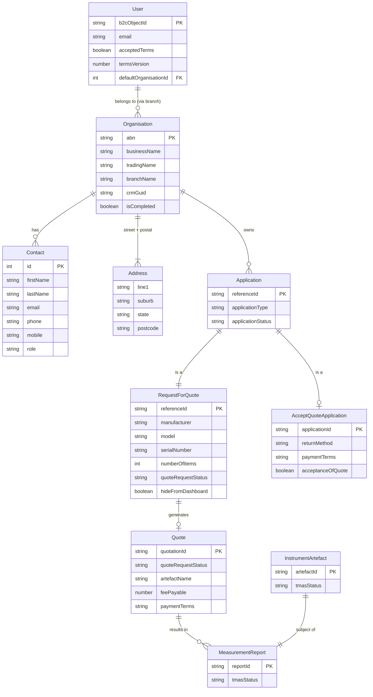

# AI-Native Specification — NMI Customer Portal
**Produced by:** `/modernize-reimagine` Phase A
**Date:** 2026-06-02
**Source documents:** `BUSINESS_RULES.md` (53 rules), `DATA_OBJECTS.md`, interface catalog (19 interfaces)
**This spec is the source of truth for the reimagined system. The legacy codebase is reference only.**

---

## 0. Alignment Baseline

- Canonical open security set for migration tracking is: **SEC-001, SEC-008, SEC-009, SEC-010, SEC-011, SEC-012**.
- **SEC-010** remains the sole P0 go-live gate and requires backend ownership verification or explicit written risk acceptance.
- Phase 1 code remediation scope remains SEC-001, SEC-009, and SEC-011, while SEC-008 and SEC-012 remain tracked architectural/back-end boundary items.

---

## 1. Capabilities

The following capabilities are derived from the extracted business rules + interface contracts. Each is tagged with a priority heuristic (see Phase B for confirmed P0/P1/P2).

| ID | Capability | Description | Candidate Priority |
|---|---|---|---|
| CAP-01 | Authentication & Session Init | OIDC/PKCE sign-in via Azure AD B2C; silent token acquisition before every API call; server-side session handshake (`UsersClient.signIn`) on every authenticated page load | P0 |
| CAP-02 | Terms of Use Acceptance | Version-matched T&C gate; blocks all dashboard access until accepted; forced re-acceptance on version bump | P0 |
| CAP-03 | Account Onboarding — Organisation | Create or update a customer organisation account (ABN, business name, ASIC-validated, address) | P0 |
| CAP-04 | Account Onboarding — Contact | Create or update the primary contact for an organisation; at-least-one-phone rule | P0 |
| CAP-05 | Branch / Organisation Selection | Force selection of default org branch when multiple exist; block all dashboard access until selected | P0 |
| CAP-06 | Dashboard — Requests Tab | Paginated, filtered, searchable list of submitted RFQs with status pills and action menus; status-gated actions | P0 |
| CAP-07 | Dashboard — Drafts Tab | Paginated list of saved RFQ drafts; Edit and Delete actions only | P0 |
| CAP-08 | Dashboard — Instruments Tab | Paginated list of customer's physical instruments/artefacts currently with NMI | P0 |
| CAP-09 | Request for Quote — Create | Three-step wizard (Organisation & Contact → Instrument & Request → Summary & Submit); draft-save between steps; submission is irreversible | P0 |
| CAP-10 | Request for Quote — Edit | Edit an existing draft RFQ (re-enters wizard at last incomplete step) | P0 |
| CAP-11 | Request for Quote — Copy (Recalibration) | Copy a completed/withdrawn RFQ as a new recalibration request; pre-populates instrument data | P1 |
| CAP-12 | Request for Quote — View Summary | Read-only view of a submitted RFQ (opens in new tab) | P1 |
| CAP-13 | Quotation — View & PDF Download | Read-only quotation detail view; status-dependent PDF download (offer / accepted / declined); status-specific initial page number | P0 |
| CAP-14 | Quotation — Decline | Irreversible decline of a quote offer; confirmation modal with explicit warning | P0 |
| CAP-15 | Accept Quote Wizard | Four-step wizard (Report Recipient → Delivery & Return → Payment → Summary & Accept); draft-save; acceptance is irreversible; T&C checkbox required | P0 |
| CAP-16 | Payment Terms Display | Prepaid vs 30-day invoice copy based on `paymentTerms` field; 30-day default for all non-Prepaid values | P0 |
| CAP-17 | Measurement Reports — List | Paginated list of measurement reports for a given instrument | P1 |
| CAP-18 | Measurement Reports — Detail & PDF | View report detail; download report PDF; suppress view link for Withdrawn reports | P1 |
| CAP-19 | Optimistic UI — Post-Acceptance Status | Override dashboard item status to Accepted immediately after accept-quote submission; clear stale token on next load | P1 |
| CAP-20 | ABN Validation | ATO weighted checksum (mod-89, 11-digit); applied at account creation | P0 |
| CAP-21 | Australian Address Validation | Postcode range check (200–299 ACT, 800–9999 other); state enum; manual vs. autocomplete mode | P0 |
| CAP-22 | Contact Validation | Email, phone (AU landline/mobile/1800/1300), name charset (no accented chars); at-least-one-phone rule | P0 |
| CAP-23 | RFQ Field Validation | Serial number, manufacturer, model, description (400 chars), testing requirements (2000 chars), item count (1–100), preferred date not-in-past | P0 |
| CAP-24 | Accept Quote Validation | Carrier details when client provides shipping; invoice contact when sent to different person; acceptance T&C boolean required | P0 |
| CAP-25 | Dashboard Filter Persistence | Persist filter/sort/page state server-side via `UsersClient.setUserProfile`; restore on next login | P2 |
| CAP-26 | External Link (EXTERNAL_REDIRECT_URL) | Hard navigation back to the main NMI website from within a wizard form; domain-allowlisted | P1 |
| CAP-27 | Telemetry — App Insights | Auto-collected page views, API dependencies, unhandled exceptions; no PII | P1 |
| CAP-28 | Analytics — Google Analytics 4 | Page views and click events on key interactions; anonymised; PII tracking disabled | P2 |
| CAP-29 | Notification System | One-shot success/error banners surfaced via sessionStorage tokens after redirect | P1 |
| CAP-30 | Error Boundary & Error Routes | Unhandled errors caught by React Error Boundary and App Insights; standard error pages (not-found, server-error, forbidden, conflict, etc.) | P0 |

---

## 2. Domain Model

### Entity List

| Entity | Description | Key Rules |
|---|---|---|
| **User** | Authenticated NMI portal user; linked to a B2C identity | RULE-004 (T&C gate), CAP-01 |
| **Organisation** | A registered NMI customer organisation (company + branches); identified by ABN | RULE-022 (ABN checksum), RULE-035 (ASIC charset), CAP-03 |
| **Branch** | A location of an Organisation; a user may be linked to multiple | RULE-005 (branch gate), CAP-05 |
| **Contact** | A person associated with an Organisation; at-least-one-phone | RULE-038, CAP-04, CAP-22 |
| **Application** | An in-progress or completed workflow instance (RFQ or Accept Quote type) | CAP-09, CAP-15 |
| **RequestForQuote** | A calibration service request with instrument details and testing requirements | RULE-013 (irreversible on submit), CAP-09, CAP-23 |
| **Quote** | An NMI-produced calibration quotation derived from an RFQ; customer accepts or declines | RULE-006 (12 status lifecycle), RULE-007 (document mapping), RULE-012/014 |
| **AcceptQuoteApplication** | The multi-step acceptance wizard data: report recipient, delivery, payment, summary | RULE-017 (payment terms), RULE-040 (T&C checkbox), CAP-15 |
| **MeasurementReport** | An NMI-issued calibration report for a physical instrument/artefact | RULE-019 (withdrawn suppression), CAP-17/18 |
| **InstrumentArtefact** | A physical instrument currently at NMI facilities | CAP-08 |
| **Address** | Street or postal address (Australian only) | RULE-031 (postcode), CAP-21 |
| **Notification** | Short-lived sessionStorage success/error token written before a redirect | CAP-29 |
| **UserProfile** | Persisted dashboard filter preferences (tab, year, status, sort, page, search) | CAP-25 |

### Entity Relationship Diagram



---

## 3. Interface Contracts

### 3.1 Authentication — Azure AD B2C (OIDC/PKCE)

```yaml
# Inbound to portal (callback after B2C redirect)
openapi: "3.0.0"
info:
  title: Azure AD B2C Auth Callback
paths:
  /auth/callback:
    get:
      summary: MSAL handles the OIDC authorization code callback
      parameters:
        - name: code
          in: query
          schema: { type: string }
        - name: state
          in: query
          schema: { type: string }
      responses:
        "302":
          description: MSAL exchanges code for tokens; redirects to original route

# Runtime env vars required:
# REACT_APP_B2C_CLIENTID, REACT_APP_B2C_AUTHORITY, REACT_APP_B2C_REDIRECT_URL
# REACT_APP_B2C_READ_SCOPE, REACT_APP_B2C_USER_IMPERSONATION_SCOPE
# REACT_APP_B2C_KNOWN_AUTHORITIES, REACT_APP_B2C_POST_LOGOUT_REDIRECT_URL
```

### 3.2 NMI Backend REST API — Core Contracts

All endpoints share:
- `Authorization: Bearer <access_token>` (required)
- `TargetOrganisationAbn: <abn>` (custom header — org context)
- Base URL: runtime-injected via `REACT_APP_API_BASE_URL` (inferred)
- Error format: `ProblemDetails` (RFC 7807) or `ValidationProblemDetails`
- HTTP 412 = precondition failed (concurrency/state mismatch)

```yaml
# Users — Session Init
PUT /api/users/sign-in
  # Body: {} (identity from Bearer token)
  # Invocation contract: call on every authenticated page load to initialise portal session context
  # Returns: UserDto {
  #   userId, contactId, firstName, lastName, email,
  #   acceptedTerms: boolean, termsVersion: number,
  #   defaultOrganisationId: number | null,
  #   organisation: OrganisationDto,
  #   contact: ContactDto,
  #   userProfile: UserProfileDto
  # }

PUT /api/users/set-user-profile
  # Body: UserProfileDto
  # Invocation contract: called on dashboard filter/sort/page/search changes to persist UI state server-side

PUT /api/users/accept-terms
  # Body: { termsVersion: number }

PUT /api/users/set-default-organisation
  # Body: { defaultOrganisationId: number, rfqId?: string }

# Dashboard — Filtered Lists
GET /api/dashboard/get-filtered-dashboard-quotes
  # Query: portalId, year?, status?, sortOrder?, searchText?, pageNumber, pageSize
  # Returns: PagedListOfDashboardItemDto

GET /api/dashboard/get-filtered-dashboard-drafts
  # Query: (same)

GET /api/dashboard/get-filtered-dashboard-artefacts
  # Query: (same)

# Dashboard — PDF Downloads
GET /api/dashboard/get-quote-offer-pdf?quoteID=&returnFile=
GET /api/dashboard/get-quote-request-accepted-pdf?quoteRequestID=&returnFile=
GET /api/dashboard/get-quote-request-rejected-pdf?quoteRequestID=&returnFile=
GET /api/dashboard/get-quote-report-pdf?quoteRequestID=&returnFile=
  # All return: DownloadedFileResponse { filename, mimeType, fileData, fileSizeBytes }

# Request for Quote — Wizard Steps
GET  /api/request-for-quote/{applicationId}/step-statuses
GET  /api/request-for-quote/{applicationId}/organisation-and-contact
PUT  /api/request-for-quote/{applicationId}/organisation-and-contact
GET  /api/request-for-quote/{applicationId}/instrument-and-request
PUT  /api/request-for-quote/{applicationId}/instrument-and-request
GET  /api/request-for-quote/{applicationId}/summary
PUT  /api/request-for-quote/{applicationId}/submit

# Accept Quote — Wizard Steps
GET  /api/accept-quote/{applicationId}/step-statuses
GET/PUT  /api/accept-quote/{applicationId}/report-recipient
GET/PUT  /api/accept-quote/{applicationId}/delivery-and-return
GET/PUT  /api/accept-quote/{applicationId}/payment-details
GET/PUT  /api/accept-quote/{applicationId}/summary-and-accept
PUT  /api/accept-quote/{applicationId}/submit

# Quote — View & Decline
GET /api/quote/get-quote-request-details-byrefid?ApplicationType=&QuoteReferenceID=
PUT /api/quote/decline-quote?QuoteRequestId=&FirstName=&LastName=

# Accounts — Create/Update/Branch
GET /api/forms/accounts/create-account/new
PUT /api/forms/accounts/create-account/save
PUT /api/forms/accounts/create-account/complete
GET /api/forms/accounts/{organisationId}
PUT /api/forms/accounts/branch-add/complete

# Contacts
GET /api/contact/usercontact
PUT /api/contact/save-contact

# Application lifecycle
POST /api/application              # create new RFQ application
POST /api/application/{id}/copy    # copy for recalibration
PUT  /api/application/{id}/delete  # soft-delete draft

# Reference data
GET /api/lookup?LookupType=<CRMLookupTypes>
GET /api/lookup/artefact-type?MeasurementCategoryId=
GET /api/address/search?Keyword=
GET /api/organisations/byabn?abn=&isCompleted=
```

### 3.3 Azure Application Insights (Outbound Telemetry)

```yaml
config:
  connectionString: $REACT_APP_APPINSIGHTS_CONN_STRING
  autoCollected:
    - pageViews (on React Router route change)
    - httpDependencies (all fetch calls)
    - exceptions (via React ErrorBoundary)
  customEvents: none
  piiLoggingEnabled: false
  disablePageUnloadEvents: [unload]
```

### 3.4 Google Analytics 4 (Outbound Events)

```yaml
trackingId: $REACT_APP_GA_TRACKINGID
events:
  - action: Click
    category: dashboard | filter | request-list | header | modal | pdf-download
    label: <button or link name>
pageviews: auto on route change
anonymizeIp: configurable
piiEvents: disabled (trackGAPii commented out)
```

### 3.5 Browser Storage Contracts

```typescript
// sessionStorage — targetOrganisation
interface TargetOrganisation {
  targetOrganisationAbn: string;   // 11-digit string, no spaces
  targetOrganisationName: string;
}
// key: 'targetOrganisation' | Written by AccountProvider | Read by AuthorizedApiBase

// sessionStorage — notification tokens (one-shot, cleared on read)
// 'accepted-quote-id'   → referenceId string  (post-accept optimistic override)
// 'view-quote-id'       → referenceId string  (quotation view override)
// 'rfqNotification'     → NotificationDetails (post-RFQ-submit banner)
// 'acceptQuoteNotification' → NotificationDetails (post-acceptance banner)
// 'dashboardNotification'   → NotificationDetails (account creation success)
```

### 3.6 External Navigation (EXTERNAL_REDIRECT_URL)

```yaml
type: hard browser navigation (location.replace)
target: $REACT_APP_EXTERNAL_REDIRECT_URL
  # Must match: /measurement\.gov\.au/ or /localhost/
  # Violation throws at SPA startup — SPA will not mount
trigger: "Cancel" / "Discard" on wizard forms where locationOnDiscard starts with https://
direction: outbound (user leaves SPA, cannot return via back button)
```

---

## 4. Non-Functional Requirements

Inferred from legacy behavior and known gaps:

Must-address observations from interface catalog analysis:
- **OBS-001**: No retry logic exists in legacy clients; every API failure propagates to UI components.
- **OBS-002**: `UsersClient.signIn` is a per-authenticated-page-load session-init handshake, not a login-only call.
- **OBS-003**: Dashboard filter changes are coupled to backend persistence through `UsersClient.setUserProfile` on each filter change.

| ID | Requirement | Source | Legacy behavior | Gap in legacy |
|---|---|---|---|---|
| NFR-01 | Auth PKCE/OIDC via Azure AD B2C | CAP-01, authConfig.ts | MSAL v3, redirect-only | loadFrameTimeout=0 (no iframe timeout) — fix in target |
| NFR-02 | No unauthenticated access to any route | RULE-001–005 | AuthenticatedElement wraps all protected routes | String-based path guards in PreConditions — brittle |
| NFR-03 | All API calls must carry Bearer token + TargetOrganisationAbn header | Interface catalog | AuthorizedApiBase injects both | ABN read at construction time, not per-request (SEC-001) |
| NFR-04 | API calls must handle 412 (precondition failed) gracefully | AcceptQuoteClient, AccountsClient | WizardRoutedStep redirects to /not-found or /server-error | No user-friendly retry or recovery path |
| NFR-05 | No retry logic exists in legacy; target must implement deterministic retry policy for idempotent requests | All 11 API clients, OBS-001 | Throws on non-200/204 | Add capped exponential back-off + jitter for idempotent GETs; keep non-idempotent mutations single-attempt unless endpoint contract supports idempotency keys |
| NFR-06 | Page size 10 for all paginated lists | CAP-06/07/08, dashboard/index.tsx:51 | Hardcoded | Should be configurable per environment |
| NFR-07 | Australian-only address validation | RULE-031 | Postcode range 200–299, 800–9999 | None |
| NFR-08 | T&C version control via config file | RULE-004, RULE-052 | terms-config.json:1 | NMI ABN/address and PDF page numbers also hardcoded — externalise all |
| NFR-09 | No PII in telemetry | SEC-005 (closed) | PII scrubbed | Re-verify in target repo: AppInsights piiLoggingEnabled:false |
| NFR-10 | sessionStorage (not localStorage) for token/org storage | CAP-01, storage/* | Session-scoped, cleared on tab close | MSAL cache location not explicitly set — confirm defaults |
| NFR-11 | WCAG 2.1 AA accessibility | Storybook a11y addon, skip-links, ARIA | Partial (skip-links, aria-busy on spinner) | No explicit a11y test suite |
| NFR-12 | CSP Trusted Types policy | trustedtypes.ts | Closed (SEC-004 fixed) | Verify policy survives Vite build |
| NFR-13 | Domain allowlist for external redirects | EXTERNAL_REDIRECT_URL | measurement.gov.au or localhost | Verified at startup — maintain in target |
| NFR-14 | Session-init handshake must execute on every authenticated page load | CAP-01, OBS-002 | `UsersClient.signIn` called by authenticated route flows, not only during interactive sign-in | Easy to regress by moving call into login callback only |
| NFR-15 | Dashboard filter state persistence coupling must be preserved or explicitly replaced with an approved alternative | CAP-25, OBS-003 | Filter/sort/page state persisted server-side and restored after sign-in | Coupling is non-obvious; removing it silently changes user experience and cross-device continuity |

---

## 5. Behavior Contract (P0 Given/When/Then Rules)

These are the acceptance tests. Every reimagined capability must implement these exactly.

### Authentication & Onboarding

```gherkin
# RULE-004
Given  user.acceptedTerms !== true OR user.termsVersion ≠ currentTermsVersion
When   user accesses any protected route
Then   TermsAndConditionModal blocks all content
And    on acceptance: call UsersClient.acceptTermsAndCondition({ termsVersion: current })

# RULE-001
Given  accountCreationCompleted === false
When   user navigates to any path not containing 'create-account'
Then   redirect to /create-account

# RULE-002
Given  accountCreationCompleted === true AND accountContactCompleted === false
When   user navigates to any path not containing 'create-contact' or 'create-account'
Then   redirect to /create-contact

# RULE-005
Given  userAcceptedTermsOfUse === true AND accountContactCompleted === true
  AND  defaultOrganisationId === null
  AND  path does not include 'success-creating-account'
When   any protected page renders
Then   BranchSelectorModal is displayed and cannot be dismissed without selecting an org

# RULE-053
Given  user is authenticated and navigates to or refreshes any protected route
When   page initialisation executes
Then   call UsersClient.signIn exactly once for that page load
And    hydrate session context (terms, default org, user profile) from returned UserDto before protected content actions
```

### Dashboard Filter Persistence

```gherkin
# RULE-054
Given  user changes dashboard filters (tab/year/status/sort/search/page)
When   the UI state changes
Then   call UsersClient.setUserProfile with the updated filter state
And    treat persistence failure as a recoverable error (do not corrupt current in-memory filter state)

# RULE-055
Given  user re-enters an authenticated session
When   UsersClient.signIn returns UserDto.userProfile
Then   initialize dashboard filters from persisted server-side userProfile values
And    only fall back to client defaults when userProfile fields are absent
```

### Quote Status Lifecycle

```gherkin
# RULE-006
Given  a RequestForQuote record
Then   valid status values are exactly:
  Submitted | Quote - In Progress | Quote - Available | Quote - Accepted |
  Quote - Declined | Quote - Expired | Quote - Closed |
  Report - Issued | Report - In progress | Report - Withdrawn | Artefact - Received

# RULE-007
Given  quoteRequestStatus === 'Quote - Accepted' OR 'Artefact - Received'
When   user clicks download
Then   call DashboardClient.getQuoteRequestAcceptedPDFByID

Given  quoteRequestStatus === 'Quote - Declined'
When   user clicks download
Then   call DashboardClient.getQuoteRequestRejectedPDFByID

Given  quoteRequestStatus === 'Quote - Available' OR 'Quote - Closed'
When   user clicks download
Then   call DashboardClient.getQuoteOfferPDFByQuoteID

Given  quoteRequestStatus === 'Report - Issued' AND context is NOT quotation tab
When   user clicks download
Then   call DashboardClient.getQuoteReportPDFByID

Given  any other status
When   user clicks download
Then   reject with an error (no document available)
```

### Irreversibility

```gherkin
# RULE-012
Given  quoteRequestStatus === 'Quote - Available'
When   user confirms decline
Then   call QuoteClient.declineQuote
And    display: "Note: Declining this quote cannot be undone"
And    no further actions available on this record

# RULE-013
Given  user is on RFQ Summary step
When   user confirms submission
Then   call RequestForQuoteClient.submit
And    display: "Once submitted, you will not be able to make further changes"
And    record moves from Drafts to Requests tab

# RULE-014
Given  user is on Accept Quote Summary & Accept step
When   user confirms acceptance (acceptanceOfQuote === true)
Then   call AcceptQuoteClient.submit
And    display: "Once accepted, you will not be able to make further changes"
```

### Payment Terms

```gherkin
# RULE-017
Given  acceptQuotePreInfo.paymentTerms === 'Prepaid'   (exact case-sensitive match)
When   accept quote wizard completes
Then   display prepayment instructions:
  "An invoice will be forwarded... calibration may only commence once payment is received"

Given  paymentTerms is any other value
Then   display: "Invoices must be paid within 30 days of NMI invoice date"
```

### ABN Validation

```gherkin
# RULE-022
Given  an 11-character string with no whitespace
When   ABN checksum validation runs
Then:
  weights = [10,1,3,5,7,9,11,13,15,17,19]
  adjusted_first = first_digit - 1
  sum = Σ (weights[i] × digit[i])  where digit[0] = adjusted_first
  valid = (sum % 89 === 0)
  "51824753556" → sum=534 → VALID
  Any other length or whitespace → INVALID
```

### Accept Quote — Legal Gate

```gherkin
# RULE-040
Given  user is on Summary & Accept step
When   acceptanceOfQuote === false (checkbox unchecked)
Then   submit is blocked: "You must accept our terms before accepting this quotation"
```

---

## 6. Capabilities Pending P0 Confirmation (Phase B)

The following capabilities have no clear regulatory/financial mandate and are candidates for deferral or drop in the reimagined system:

| CAP | Capability | Why it might be dropped/deferred |
|---|---|---|
| CAP-25 | Dashboard filter persistence (server-side) | High coupling between UI state and backend; only replace with a documented alternative if explicit cross-device/session continuity requirements are re-baselined |
| CAP-19 | Optimistic UI post-acceptance | Workaround for CRM propagation latency — if CRM is faster in target environment, may not be needed |
| CAP-28 | Google Analytics 4 | No regulatory requirement; optional for government portal analytics policy |
| CAP-11 | RFQ Copy (Recalibration) | P1 convenience; could launch post-MVP |
| CAP-12 | RFQ View Summary (new tab) | P1 convenience; inline view is simpler |
| CAP-26 | EXTERNAL_REDIRECT_URL navigation | Tight coupling to current sibling site structure; may change in new portal architecture |

---

*Source artifacts:*
*`analysis/BUSINESS_RULES.md` · `analysis/DATA_OBJECTS.md` · interface catalog from legacy-analyst subagent*
*Full business rules with detailed edge-cases: see BUSINESS_RULES.md*
