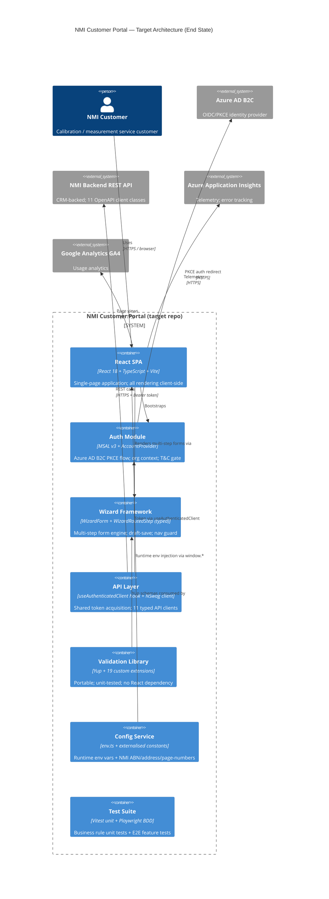
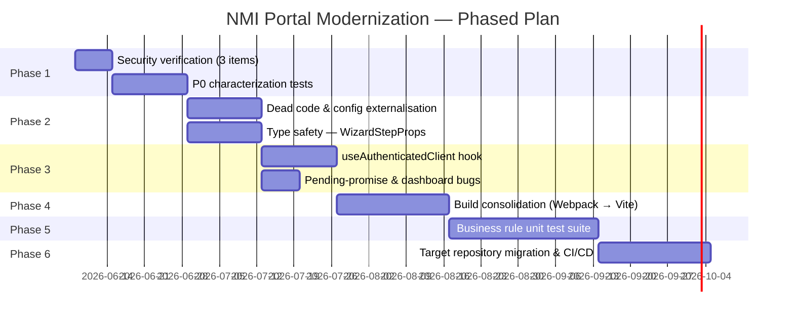

# Modernization Brief — NMI Customer Portal
**Version:** 1.3 · **Date:** 2026-06-04
**Status:** DRAFT — awaiting steering committee approval
**Pattern:** Refactor (incremental; no rebuild required)
**COCOMO estimate:** 77–115 person-months (full system); targeted refactor scope: ~21–29 person-weeks
**Change from v1.2:** Updated 2026-06-04 — SEC-001, SEC-009, SEC-011 closed in source snapshot as BRIEF-SEC-001/009/011 (CRD-029, CRD-031); SEC-010 closed 2026-06-04 (pentest-confirmed; CRD-035); open set now SEC-008 (by-design), SEC-012 (architectural). Bootstrap grid dropped per CRD-034; design tokens + CSS Grid replace it. Phase 1 code fixes are pre-completed — verify after migration.

---

## 1. Objective

The NMI Customer Portal (`ClientApp/src`) is a React 18 + TypeScript SPA of approximately 23,800 SLOC, serving Australian businesses who need calibration, measurement, and testing services from the National Measurement Institute. It is architecturally sound — the domain model is clear, all dependencies are on current major versions, and the business workflows are well-defined — but has accumulated targeted technical debt that materially increases migration and maintenance risk: the wizard engine that drives every multi-step form runs on an `[key: string]: any` prop interface that erasing compile-time guarantees for 100% of the portal's primary workflows; 26 separate files independently repeat the same auth token acquisition sequence with no shared abstraction; one High-severity security finding (an unconfirmed server-side IDOR) remains as the principal go-live blocker; and there are zero unit tests within `ClientApp/src` despite 53 identified business rules with regulatory and commercial significance. Prior security hardening work has already closed seven findings (auth bypass removal, Trusted Types policy, `noopener` hardening, PII telemetry scrub, open-redirect allowlist). The canonical open migration security set is SEC-008 (by-design) and SEC-012 (architectural debt). All P1 security items closed: SEC-010 closed 2026-06-04 via pentest-confirmed remediation (CRD-035); SEC-001, SEC-009, SEC-011 closed 2026-06-01 (CRD-029, CRD-031). The modernization program will refactor the existing codebase into the target repository in six phased increments, delivering a type-safe, single-build-system, well-tested application that can be confidently deployed and maintained by a new engineering team without institutional knowledge currently locked in source code.

---

## 2. Target Architecture

No stack replacement is required. The recommended target is the **existing stack, consolidated and hardened**:

| Layer | Current | Target |
|---|---|---|
| Language | TypeScript 5.9 | TypeScript 5.9 (no change) |
| UI framework | React 18 | React 18 (no change) |
| Routing | React Router v6 | React Router v6 (no change) |
| Auth | MSAL v3 (Azure AD B2C) | MSAL v3 (no change) |
| Forms | Formik + Yup | Formik + Yup (no change) |
| CSS | Bootstrap 5 + SCSS | Design tokens (`var(--nmi-*)`) + CSS Grid/Flexbox — Bootstrap grid dropped (CRD-034); `@nmi/design-tokens` replaces `_variables.scss` |
| API client | NSwag-generated | NSwag-generated (regenerate from live spec) |
| Production build | **Webpack 5** | **Vite 8** (consolidate dual build system) |
| Test build | Vite 8 | Vite 8 (no change) |
| Unit tests | *None in `ClientApp/src`* | **Vitest with ≥80% coverage on business rules** |
| E2E tests | Playwright BDD | Playwright BDD (no change) |
| Component docs | Storybook 10 | Storybook 10 (no change) |
| CSP | Trusted Types + DOMPurify | Trusted Types (SEC-004 closed in prior sprint; verify policy survives Vite build in Phase 4) |

### C4 Container Diagram — End State



### Legacy → Target Component Mapping

| Legacy Component | Target Component | Change Type |
|---|---|---|
| `ClientApp/src/trustedtypes.ts` | Same file, fixed `createScriptURL` handler | Security fix (SEC-004) |
| `ClientApp/src/components/forms/WizardForm/types.ts` | Typed `WizardStepProps<T>` without `[key: string]: any` | Type safety (Debt #2) |
| `ClientApp/src/components/forms/WizardForm/WizardRoutedStep.tsx` | Same + `children: ReactNode` on `PreConditions` | Type safety |
| `routes/**/…Props.ts` (26 files) | Consolidated via `useAuthenticatedClient<T>` hook | Deduplication (Debt #1) |
| `routes/common/helperFunctions.ts` (pending promise) | Fixed `default` branch with `Promise.reject` | Bug fix (Debt #8) |
| `routes/common/helperFunctions.ts` (`getFileIdFromBase64`) | Deleted (dead duplicate) | Dead code (Debt #6) |
| `env.ts` (`REACT_APP_APPINSIGHTS_INSTRUMENTATIONKEY`) | Removed from `requiredVars` | Dead code (Debt #7) |
| `routes/dashboard/index.tsx` (dead `isLoading`/`scrollToTop`) | Fixed state wiring | Bug fix (Debt #5) |
| `routes/preConditions/PreConditions.tsx` (string path guards) | Route constants from `common/constants.ts` | Architecture smell (Debt #10) |
| `components/Utilities/nMIContactDetails.tsx` (unsanitised `href`) | Validated `tel:`/`mailto:` values | Security fix (SEC-003) |
| `routes/*/quoteDetails.tsx` (`window.open` + `location.href`) | `window.open(url, '_blank', 'noopener,noreferrer')` | Security fix (SEC-002, SEC-007) |
| `AccountProvider.tsx` (ABN in verbose telemetry) | Redacted to opaque IDs | Security fix (SEC-005) |
| `authentication/authConfig.ts` (`loadFrameTimeout: 0`) | Set to `6000` ms | Security fix (SEC-009) |
| `routes/acceptQuote/summaryAndAccept.tsx` (NMI ABN/address) | Read from `config_svc` | Configuration externalisation |
| `routes/common/helperFunctions.ts` (PDF page numbers) | Read from `config_svc` | Configuration externalisation |
| `webpack.config.js` (production build) | `vite.config.ts` | Build consolidation (Phase 3) |
| *(none)* | `hooks/useAuthenticatedClient.ts` | New shared auth hook |
| *(none)* | `tests/unit/validationSchemas/**` | New unit test files |
| *(none)* | `tests/unit/businessRules/**` | New business rule tests |

---

## 3. Phased Sequence

### Phase Gantt



---

### Phase 1 — Security Verification (Pre-completed in Source Snapshot)

**Scope:** Three security code fixes (SEC-001, SEC-009, SEC-011) are **already complete in the source snapshot** (CRD-029, CRD-031, 2026-06-01). Prior work also closed: auth bypass removal (old-SEC-001/007), Trusted Types policy (old-SEC-002), `noopener` hardening (old-SEC-003/009), PII telemetry scrub (old-SEC-005), and open-redirect allowlist (old-SEC-008). Do not re-open those items — see `analysis/ASSESSMENT.md` Reconciliation table for closure evidence. **Migration task: verify all closed items still behave correctly in the target repository environment.**

| Item | ID | File | Fix | Severity |
| --- | --- | --- | --- | --- |
| `TargetOrganisationAbn` header read from mutable sessionStorage at construction time | SEC-001 | `api/web-api-client.ts:13` | **DONE IN SOURCE** — `sessionStorage.getItem` moved inside `transformOptions`; BRIEF-SEC-001 closed 2026-06-01 (CRD-031). Verify after migration. | Medium |
| MSAL `loadFrameTimeout: 0` removes silent-renewal iframe timeout bound | SEC-009 | `authentication/authConfig.ts:42` | **DONE IN SOURCE** — Set to 6000ms; BRIEF-SEC-009 closed 2026-06-01 (CRD-029). Verify after migration. | Low |
| URL `id` params passed to API calls without format validation; `Number()` cast produces `0` for NaN | SEC-011 | `requestForQuote/index.tsx:47`, `account/update/index.tsx:39` | **DONE IN SOURCE** — URL ID param validation added; BRIEF-SEC-011 closed 2026-06-01 (CRD-029). Verify after migration. | Medium |

**Note on SEC-010 (IDOR):** ~~P0 entry criterion~~ — **CLOSED 2026-06-04** — backend team confirmed pentest-identified remediation prior to go-live (CRD-035). Phase 1 entry criterion is met.

**Note on SEC-008 / SEC-012:** Client-side pre-condition enforcement (SEC-008) is by-design UX gating; server-side enforcement is the backend team's responsibility. ABN in unencrypted sessionStorage (SEC-012) is low-severity and architectural — addressed in Phase 3 when `AuthorizedApiBase` is refactored.

**Entry criteria:** SEC-010 IDOR — **MET** — closed 2026-06-04 (CRD-035).

**Exit criteria:**

- SEC-001, SEC-009, SEC-011 source fixes verified in target repo (pre-completed; see CRD-029, CRD-031)
- Storybook test suite passes (165/165)
- Playwright BDD e2e suite passes on staging
- Confirm previously closed items (Trusted Types, `noopener`, PII) still behave correctly in the target repo environment

**Estimated effort:** 1–2 person-weeks

**Risk level:** Low

| Risk | Mitigation |
|---|---|
| Moving sessionStorage read into `transformOptions` (SEC-001) changes timing — client constructor is reused across renders | Verify all `*Props.ts` call sites create `new XxxClient()` locally at call time (confirmed in debt analysis); no cached instances found |
| URL param validation (SEC-011) may trigger `/not-found` redirects for legitimate deep-link URLs from NMI CRM emails | Test with a set of production-format CRM URLs before merge; whitelist UUID and positive-integer formats |

---

### Phase 2 — Type Safety & Dead Code Removal
**Scope:** WizardStepProps typing, dead code removal, configuration externalisation. No user-facing behavior change.

| Item | File | Fix |
|---|---|---|
| Debt #2: `[key: string]: any` on `WizardStepProps` | `WizardForm/types.ts:122,164` | Type `validateHard`, `validateSoft`, `hidingFields` explicitly; remove index signature |
| Debt #9: `children: any` on PreConditions | `PreConditions.tsx:18` | Change to `ReactNode` |
| Debt #5: Dead `isLoading`/`scrollToTop` state | `dashboard/index.tsx:253,258` | Wire up setters or remove dead state + dependent blocks |
| Debt #6: `getFileIdFromBase64` duplicate | `helperFunctions.ts:101` | Delete; confirm no callers |
| Debt #7: Orphaned `REACT_APP_APPINSIGHTS_INSTRUMENTATIONKEY` | `env.ts:20,36,50,92` | Remove from `requiredVars` and `EnvType` |
| RULE-050/051: NMI ABN/address hardcoded | `summaryAndAccept.tsx:382-388` | Move to `env.ts` / config service |
| RULE-008: PDF page numbers hardcoded | `helperFunctions.ts:126-134` | Move to `config_svc` |
| Dangling exports | `GoogleAnalytics.tsx`, `notification.ts` | Remove unused exported functions |

**Entry criteria:** Phase 1 merged and green in CI.

**Exit criteria:**
- TypeScript compilation passes with `"noImplicitAny": true` in `tsconfig.json`
- All 16 `*Props.ts` files compile without `eslint-disable @typescript-eslint/no-explicit-any`
- Storybook + Playwright suites pass
- NMI ABN/address read from environment config in staging deploy

**Estimated effort:** 4–5 person-weeks

**Risk level:** Medium

| Risk | Mitigation |
|---|---|
| Typing `WizardStepProps` reveals latent type mismatches in consumer `*Props.ts` files | Allocate 1 extra week buffer; fix consumer files as discovered during Phase 2 (they will be fixed in Phase 3 anyway) |
| Removing `isLoading` state in Dashboard affects `aria-busy` / screen-reader behavior | Validate with accessibility audit tool before merge; confirm with a11y-aware QA pass |

---

### Phase 3 — Auth Token Centralisation & Bug Fixes
**Scope:** Extract `useAuthenticatedClient` hook; fix permanently-pending promise; fix `PreConditions` path guards.

| Item | File | Fix |
|---|---|---|
| Debt #1: 26-location token acquisition duplication | All `*Props.ts` files + `dashboard/index.tsx:422` | Create `hooks/useAuthenticatedClient.ts`; refactor all callers |
| Debt #3: `AuthorizedApiBase.targetOrganisation` stale capture | `web-api-client.ts:13` | Move `sessionStorage.getItem` into `transformOptions` |
| Debt #8: Permanently-pending promise | `helperFunctions.ts:43-44,71-72` | Replace with `Promise.reject(new Error('No document for status'))` |
| Debt #10: String-based path guards | `PreConditions.tsx:64-88` | Replace with `useMatch` + `common/constants.ts` route constants |

**`useAuthenticatedClient` hook contract:**
```typescript
// Before (repeated in 26 places):
const client = new RequestForQuoteClient();
const token = await instance.acquireTokenSilent({ ...tokenRequest, account: accounts[0] });
client.setAuthToken(token.accessToken);

// After (single declaration):
const rfqClient = useAuthenticatedClient(RequestForQuoteClient);
// hook manages token acquisition, refresh, and error handling
```

**Entry criteria:** Phase 2 merged; `WizardStepProps` fully typed (Phase 3 `*Props.ts` refactors depend on typed interfaces from Phase 2).

**Exit criteria:**
- All 26 `*Props.ts` files use `useAuthenticatedClient`
- `acquireTokenSilent` called in exactly 1 location (the hook)
- `helperFunctions.ts` `default` branch rejects rather than hangs
- Playwright BDD e2e suite passes (all wizard flows exercised)
- No regression in Storybook suite

**Estimated effort:** 4–5 person-weeks

**Risk level:** Medium

| Risk | Mitigation |
|---|---|
| `useAuthenticatedClient` must be a React hook (called inside component render) — `*Props.ts` files are currently called inside `useEffect` callbacks, not at the component level | Redesign `WizardRoutedStep` to call the hook at step-mount time and pass the authenticated client to `loadStep`/`saveStep` as a parameter |
| MSAL's `acquireTokenSilent` is async; centralising it in a hook changes the timing of when tokens are acquired relative to API calls | Benchmark on staging with Network throttling; confirm no observable latency increase |

---

### Phase 4 — Build System Consolidation (Webpack → Vite)
**Scope:** Replace the Webpack 5 production build with Vite 8. Vite already works for tests and Storybook.

**Key work items:**
- Write `vite.config.ts` for production (SCSS/Bootstrap shim, env var injection, chunk splitting)
- Migrate `index.html` from HtmlWebpackPlugin template to Vite's native HTML transform
- Validate `window.*` runtime env injection works with Vite dev server
- Validate `trustedtypes.ts` CSP policy compatibility with Vite-built bundle
- Update CI/CD scripts from `webpack build` to `vite build`
- Validate Storybook + Vitest still run correctly after the Webpack removal
- Remove `webpack.config.js`, `webpack-dev-server`, `webpack-cli`, `ts-loader`, `css-loader`, `mini-css-extract-plugin`, `style-loader`, `fork-ts-checker-webpack-plugin`, `html-webpack-plugin` from `package.json`

**Entry criteria:** Phase 3 merged; `useAuthenticatedClient` hook in place (reduces the number of files that need testing after build change).

**Exit criteria:**
- `vite build` produces a functionally equivalent bundle (verified by Playwright BDD e2e suite on the Vite-built artifact)
- Bundle size ≤ current Webpack bundle + 10%
- LCP and TTI on staging ≤ current Webpack values
- No Webpack dependencies remain in `package.json`
- `npm run dev`, `npm test`, `npm run storybook`, `npm run build` all work without Webpack

**Estimated effort:** 4–6 person-weeks (includes discovery/risk buffer)

**Risk level:** High — this is the highest-risk phase.

| Risk | Mitigation |
|---|---|
| SCSS module system (Bootstrap `@import` shim + `silenceDeprecations`) behaves differently under Vite's CSS pipeline | Prototype the SCSS build in a branch before committing to Phase 4; the `_bootstrap-import.scss` shim was explicitly designed to isolate this concern |
| `window.*` runtime env injection via server-side template may require a Vite plugin (no equivalent of HtmlWebpackPlugin out of the box) | Use `vite-plugin-html` or write a minimal transform; validate in staging with real env values before merge |

---

### Phase 5 — Business Rule Unit Test Suite
**Scope:** Write Vitest unit tests for all 53 business rules in `analysis/BUSINESS_RULES.md`, with a focus on P0 rules. Target: ≥80% line coverage on `validationSchemas/`, `routes/common/`, and `authentication/`.

**P0 rules requiring dedicated test files:**

| Rule | Test file | Coverage target |
|---|---|---|
| RULE-022: ABN checksum | `tests/unit/validationSchemas/abn.test.ts` | 100% |
| RULE-004: Terms version gate | `tests/unit/authentication/accountProvider.test.ts` | 100% |
| RULE-006: Quote status lifecycle | `tests/unit/routes/common/quoteStatus.test.ts` | 100% |
| RULE-007: Status → document mapping | `tests/unit/routes/common/helperFunctions.test.ts` | 100% |
| RULE-010: Dashboard action menu | `tests/unit/components/requestItem.test.ts` | 100% |
| RULE-012-014: Irreversibility guards | `tests/unit/routes/quotation/irreversibility.test.ts` | 100% |
| RULE-017: Payment terms | `tests/unit/routes/acceptQuote/paymentTerms.test.ts` | 100% |
| RULE-035: ASIC business name | `tests/unit/validationSchemas/businessName.test.ts` | 100% |
| RULE-040: Acceptance T&C checkbox | `tests/unit/routes/acceptQuote/acceptance.test.ts` | 100% |
| RULE-050: NMI ABN display | `tests/unit/config/nmiConfig.test.ts` | 100% |
| RULE-052: Terms version config | `tests/unit/config/termsConfig.test.ts` | 100% |

Additional P1 test files:
- All 19 Yup custom extension methods: `tests/unit/validationSchemas/stringExtensions.test.ts`
- Date validation rules: `tests/unit/validationSchemas/dateValidation.test.ts`
- Pagination algorithms: `tests/unit/components/pagination.test.ts`
- Optimistic UI override (RULE-011): `tests/unit/routes/dashboard/optimisticOverride.test.ts`

**Entry criteria:** Phase 4 merged; Vite build stable in CI.

**Exit criteria:**
- All P0 business rule tests passing
- Vitest coverage report shows ≥80% line coverage on `validationSchemas/`, `routes/common/`, `authentication/`
- `npm test` green in CI on every PR
- Coverage gate configured in `vitest.config.ts` (`coverage.thresholds.lines: 80`)

**Estimated effort:** 5–7 person-weeks

**Risk level:** Low

| Risk | Mitigation |
|---|---|
| SME confirmation still outstanding for RULE-035 (ASIC charset) and RULE-050 (NMI ABN) blocks test authoring for those rules | Write tests marked `.skip` with documented expected behavior; unblock when SME answers arrive |
| `nameAllowedFormat(extended=true)` bug (missing `^` anchor) is discovered during test writing | Log as a defect; fix the regex; add regression test |

---

### Phase 6 — Target Repository Migration & CI/CD
**Scope:** Move the refactored codebase to the target repository; establish CI/CD pipeline; performance audit; go-live readiness.

**Work items:**
- Set up target repository with branch strategy (main, staging, feature branches)
- Configure GitHub Actions CI: type-check → unit tests → Storybook build → Playwright BDD → Vite build
- Configure Vitest coverage gate (≥80% on business-rule modules)
- Add SonarQube or equivalent static analysis gate
- Performance audit: add route-level lazy loading (currently all routes bundled at startup); measure LCP improvement
- Security review: re-run Aikido/OWASP scan on final bundle
- UAT sign-off on all P0 business rules with NMI business stakeholders
- Production deploy checklist (pre-flight checklist from `docs/migration/PRE-FLIGHT-CHECKLIST.md`)

**Entry criteria:** Phase 5 merged; ≥80% P0 rule coverage confirmed; SEC-010 IDOR — **MET** — closed 2026-06-04 (CRD-035).

**Exit criteria:**
- Migration runbook (`docs/migration/MIGRATION-RUNBOOK.md`) executed successfully in staging
- UAT sign-off from NMI stakeholder for all P0 rules
- Zero High/Critical findings in final security scan
- CI/CD pipeline green on main branch
- `docs/migration/PRE-FLIGHT-CHECKLIST.md` fully signed off

**Estimated effort:** 3–5 person-weeks

**Risk level:** Medium

| Risk | Mitigation |
|---|---|
| Azure AD B2C app registration and reply URLs need updating for new domain | Co-ordinate with Azure admin team in Phase 5; do not leave to Phase 6 |
| Route-level lazy loading may reveal circular import issues masked by eager loading | Run `vite build --minify false` with bundle visualizer before adding lazy loading |

---

### Phase Effort Summary

| Phase | Scope | Effort (person-weeks) | Risk |
|---|---|---|---|
| 1 — Security verification | 3 remaining open items (SEC-001, SEC-009, SEC-011) | 1–2 | Low |
| 2 — Type safety & dead code | WizardStepProps, dead exports, config externalisation | 4–5 | Medium |
| 3 — Auth token centralisation | `useAuthenticatedClient` hook, bug fixes | 4–5 | Medium |
| 4 — Build consolidation | Webpack → Vite | 4–6 | High |
| 5 — Business rule test suite | 53 rules, ≥80% coverage | 5–7 | Low |
| 6 — Target repo & CI/CD | Migration, CI pipeline, go-live | 3–5 | Medium |
| **Total** | | **21–30 person-weeks** | |

---

## 4. Behavior Contract (P0 Rules)

The following P0 rules from `analysis/BUSINESS_RULES.md` must be proven equivalent before any phase ships. They form the mandatory regression suite.

| ID | Rule | Phase gate | SME blocker? |
|---|---|---|---|
| RULE-001 | Account creation redirect gate | Phase 1 | No |
| RULE-002 | Contact creation redirect gate | Phase 1 | No |
| RULE-004 | Terms of Use version gate | Phase 1 | No |
| RULE-005 | Branch selection gate | Phase 1 | No |
| RULE-006 | Quote status lifecycle (12 states) | Phase 1 | No |
| RULE-007 | Status → document mapping | Phase 1 | No |
| RULE-010 | Dashboard action menu by status | Phase 1 | No |
| RULE-012 | Decline is irreversible | Phase 1 | No |
| RULE-013 | RFQ submission is irreversible | Phase 1 | No |
| RULE-014 | Quote acceptance is irreversible | Phase 1 | No |
| RULE-017 | Payment terms: Prepaid vs 30-day | Phase 1 | No |
| RULE-022 | ABN checksum algorithm | Phase 2 | No |
| RULE-035 | Business name charset (ASIC-aligned) | Phase 2 | **YES** — must confirm `&` handling |
| RULE-040 | Quote acceptance T&C checkbox mandatory | Phase 2 | No |
| RULE-050 | NMI ABN hardcoded in contract display | Phase 2 | **YES** — must verify ABN is current |
| RULE-052 | Terms of Use version configuration | Phase 2 | No |

**P0 rules with Confidence < High (require SME confirmation before their phase starts):**

- **RULE-035 (Phase 2 blocker):** Can business names contain `&` (as in "Smith & Jones")? The current ASIC-referenced charset excludes it. If this is wrong, account creation silently rejects valid business names.
- **RULE-050 (Phase 2 blocker):** Verify that `74 599 608 295` is the current NMI ABN and `36 Bradfield Road, West Lindfield NSW 2070` is the current registered address. Both appear in the legal contract display on the Accept Quote summary page.

---

## 5. Validation Strategy

### Phase 1 — Security Verification

**Strategy:** Manual code review + Playwright BDD regression

The three remaining fixes (SEC-001, SEC-009, SEC-011) are small and targeted with no user-visible behavior change. Manual review by a second engineer + full Playwright BDD e2e suite on staging is sufficient. Additionally, verify that the previously closed items (Trusted Types policy, `noopener` hardening, PII scrub) are intact and functioning in the target repo environment — these should pass the existing Playwright suite without new tests.

### Phase 2 — Type Safety & Dead Code
**Strategy:** Compiler-driven + Storybook visual regression

TypeScript compilation with `noImplicitAny: true` is the primary verification mechanism — it will reject any consumer that passes wrong-typed props to the wizard framework. Storybook visual regression confirms no UI regressions. Dead code removal is verified by `grep` — zero remaining references to deleted exports.

### Phase 3 — Auth Token Centralisation
**Strategy:** Contract tests + Playwright BDD wizard flows

Every wizard flow (Create Account → Create Contact → Create RFQ → Accept Quote) must be exercised in Playwright BDD E2E against a staging environment. The `useAuthenticatedClient` hook contract is verified with a Vitest mock of `acquireTokenSilent` — unit-testing that the hook calls it exactly once per client construction, handles refresh errors, and passes the token to `setAuthToken`.

### Phase 4 — Build Consolidation
**Strategy:** Artifact diff + performance benchmarks

Run the Playwright BDD suite against the Vite-built artifact. Compare bundle sizes using `vite-bundle-visualizer` vs the prior Webpack build. Measure LCP and TTI in Chrome DevTools on staging with both builds before merge sign-off.

### Phase 5 — Business Rule Unit Tests
**Strategy:** Characterization tests (Given/When/Then) + property-based tests for the ABN algorithm

All P0 rule tests use the Given/When/Then structure from `BUSINESS_RULES.md`. The ABN checksum (RULE-022) additionally uses property-based testing (fast-check or similar) to verify the algorithm against a corpus of known-valid and known-invalid ABNs. The Yup validator suite uses table-driven tests covering every documented edge case.

### Phase 6 — Target Repository Migration
**Strategy:** Parallel-run + manual UAT

After deploy to staging target repo: run Playwright BDD e2e suite against the new environment. Then perform manual UAT of all P0 rule flows with NMI business stakeholders before production go-live. Document UAT outcomes against the P0 rule list above.

---

## 6. Open Questions

The following questions require human/SME decision before Phase 1 can start. Each is a gate that the approver must explicitly sign off.

- [x] **SEC-010 IDOR (backend): CONFIRMED 2026-06-04 — CLOSED (CRD-035).** Backend team confirmed server-side org-scoping enforcement. Pentest-confirmed remediation prior to go-live. Phase 1 entry criterion met.

- [ ] **RULE-035 ASIC charset:** Does the business name character set (which excludes `&`) correctly implement the current ASIC CompanyName rules? Can NMI account holders have business names containing `&` (e.g., "Smith & Jones Calibration Pty Ltd")? Answer determines whether `businessName()` validator needs a fix in Phase 2.

- [ ] **RULE-050 NMI ABN:** Is `74 599 608 295` the current NMI registered ABN? Is `36 Bradfield Road, West Lindfield NSW 2070` the current registered address? Both are displayed on the legal-contract-equivalent Accept Quote summary page.

- [ ] **RULE-035/042 SME review:** Have the NMI business analysts reviewed and approved the full list of P0 rules in Section 4? The brief requires at least one BA sign-off confirming the rules as documented match the intended business behavior before Phase 2 (the phase that externalises those rules into tested code).

- [ ] **Terms of Use version:** Is terms version `"1"` (in `terms-config.json`) the correct current version? Will the migration trigger a re-acceptance requirement for all users? If yes, this needs a communications plan before Phase 6 go-live.

- [ ] **RULE-008 PDF page numbers:** Are page numbers 2, 3, and 5 hardcoded against the current version of NMI's quote/report PDF template? Will the templates change during the modernization program? If yes, Phase 2 config externalisation becomes a Phase 1 item.

- [ ] **RULE-015 recalibration for ReportInProgress:** Is allowing a recalibration request while a current calibration is still in progress (`ReportInProgress`) intentional business policy? The instrument item tab shows this action; the request item tab does not.

- [ ] **Target repository:** Has the target repository been created and the team access provisioned? Phase 6 requires this. If not, this becomes a Phase 5 pre-requisite.

---

## 7. Approval Block

This document represents Phase 1 through Phase 6 of the NMI Customer Portal modernization program. Approval of this brief authorises the engineering team to proceed with Phase 1 only. Subsequent phases require the exit criteria of the preceding phase to be met and a brief review at each phase boundary.

All open questions in Section 6 must be resolved before the relevant phase starts. P0 SME blockers (RULE-035, RULE-050) must be resolved before Phase 2 starts.

```
Approved by: ________________  Title: ________________  Date: __________

Approval covers:  [ ] Phase 1 only (Security verification — 1–2 person-weeks)
                  [ ] Full plan (Phases 1–6 — 21–30 person-weeks)

Conditions / exceptions: _____________________________________________

Reviewed by (engineering lead): ________________  Date: __________
Reviewed by (security lead):     ________________  Date: __________
Reviewed by (NMI business analyst): _____________  Date: __________
```

---

*Produced by: `/code-modernization:modernize-assess` → `/modernize-map` → `/modernize-extract-rules` → `/modernize-brief`*
*Analysis files: `analysis/ASSESSMENT.md`, `analysis/TOPOLOGY.html`, `analysis/BUSINESS_RULES.md`, `analysis/DATA_OBJECTS.md`*
