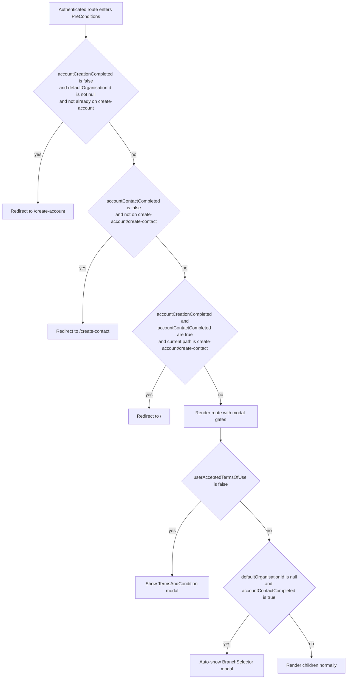

# Runtime Contracts (Wizard, Validation, Auth, and Route Guards)

This document captures implementation contracts that are easy to miss when reading individual files in isolation.

## 1) WizardRoutedStep validation contract (`validateHard` vs `validateSoft`)

`WizardRoutedStep` passes both validators into `FormikForm`:

- `validateHard`: blocking validation for forward submit/navigation
- `validateSoft`: advisory validation for draft-save (`save and exit`)

The dispatch logic lives in `ClientApp/src/components/forms/FormikForm/index.tsx`:

- If `values.saveAndExit === true`, `validateSoft` is used.
- Otherwise, `validateHard` is used.
- If a validator is omitted, that branch returns `{}` (no validation errors).

### Required behavior

| Action | Validator path | Blocking behavior |
| --- | --- | --- |
| Save and exit | `validateSoft` | Advisory only; should not enforce full final-form completeness |
| Save and next / submit | `validateHard` | Blocking; prevents progression until valid |

### Authoring rule for new wizard steps

1. Provide **both** validators when the step supports draft-save.
2. Put strict field-level or business-rule enforcement in `validateHard`.
3. Put user-friendly or partial-input checks in `validateSoft`.
4. Do not place final-submit requirements exclusively in `validateSoft`.

## 2) Yup custom extension side-effect import contract

The portal augments Yup string schemas via module augmentation in `ClientApp/src/validationSchemas/yupExtensions/stringExtensions.ts`.

Any schema file using methods like `.isRequired()`, `.allowedFormat()`, `.phone()`, `.postcode()`, `.fixedDigits()`, or `.minEntered()` must include a side-effect import:

```ts
import '../../validationSchemas/yupExtensions';
```

Without this import, runtime evaluation can fail with:

```text
schema.method is not a function
```

### Authoring rule

- Add the side-effect import at the top of every schema module that relies on custom string extensions.
- Keep the import even if TypeScript appears to infer the methods, because runtime registration is the real dependency.

## 3) `acquireTokenSilent` call pattern contract (current state)

Current pattern (before centralisation):

```ts
const tokenResult = await instance.acquireTokenSilent({
  ...tokenRequest,
  account: accounts[0],
});
client.setAuthToken(tokenResult.accessToken);
```

### `tokenRequest` shape and scopes

Defined in `ClientApp/src/authentication/authConfig.ts`:

- `scopes = [READ_SCOPE, USER_IMPERSONATION_SCOPE]`
- `tokenRequest = { scopes }`

This keeps API clients aligned to the same delegated permission set across routes.

### Why `accounts[0]` is used

The portal assumes a single interactive user session in the SPA and uses the first MSAL account as the active account for silent token retrieval.

### Current-state rationale

- Ensures each route gets a fresh access token before invoking an NSwag client.
- Keeps auth handling close to route orchestration while centralised interceptor work remains deferred.
- Supports existing route-level error handling patterns without broad churn during migration preparation.

For proposed centralisation, see ADR: `docs/adr/2026-05-30-acquire-token-silent-interceptor.md`.

## 4) PreConditions redirect state machine

`PreConditions` applies account and terms gates in this order:



### Implementation notes

- Current guards use `path.includes(...)` checks in `ClientApp/src/routes/preConditions/PreConditions.tsx`.
- Modal visibility (`TermsAndCondition`, `BranchSelector`, `RFQDelete`) sets inert mode on the wrapped content for accessibility/interaction safety.

## 5) Dual build system rationale and divergence summary

Current state is intentionally split:

- Production bundle: webpack 5
- Storybook and test tooling: Vite 8-based tooling path

Why this exists now:

- Production packaging remains aligned with the legacy portal host and current deployment process.
- Storybook and test workflows use Vite-based tooling for faster dev/test feedback.

What must be regression-tested because of this split:

- CSS and SCSS processing differences
- Module resolution and alias differences
- Asset base-path resolution differences
- Code-splitting/chunk loading behavior

See `docs/architecture/storybook-vs-webpack-runtime.md` for build-pipeline details.
