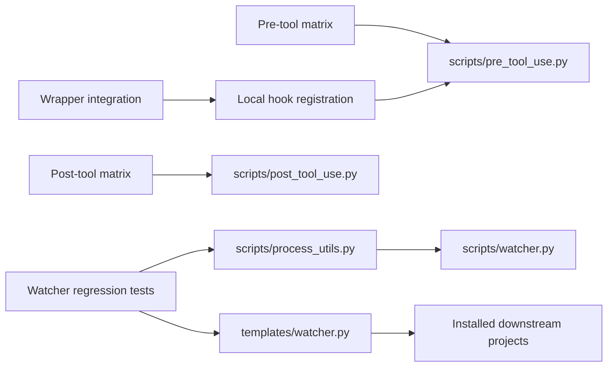

# Hook tests: Python architecture and quality review

## Assessment

All four files scored below 95 before remediation and were refactored. Final
assessment: **93.5/100 aggregate; RED integration status**. The harness now
reports defects honestly, but the hook system has 16 failing behavioral cases. A
numeric score is not evidence of readiness. The pre-tool and watcher reviews
remain below the requested threshold because upstream behavior and contract
questions remain unresolved; more test restructuring cannot correct those
implementations.

| File                                | Before | After | Expected outcome and observed evidence                                                                                                                         |
| ----------------------------------- | -----: | ----: | -------------------------------------------------------------------------------------------------------------------------------------------------------------- |
| `tests/hooks/test_post_tool_use.py` |     88 |    98 | Successful file operations emit the exact review reminder; malformed/unrelated/failed events remain silent. All 27 cases pass.                                 |
| `tests/hooks/test_pre_tool_use.py`  |     48 |    89 | Guard decisions preserve legitimate work, block sensitive/destructive actions, and keep private content out of logs. 49 pass, 14 fail.                         |
| `tests/hooks/test_watcher_pid.py`   |     42 |    91 | Maintained and distributed watchers detect liveness without terminating targets, and assertions fail on regressions. 16 pass, 2 fail.                          |
| `tests/hooks/test_wrapper.py`       |     46 |    96 | Local wrapper forwards decisions, warns on a missing guard, and blocks crashes under the existing configured policy. All 5 cases pass with Git Bash available. |

Scores are reviewer judgments against the frozen rubric below, not automated
analyzer scores. Post-tool and wrapper behavior is verified for the exercised
Windows environment; this is not a repository-wide production-readiness claim.

## Artifact and diagnostic provenance

Reviewed the user's current working files against HEAD
`ef53dd8f9700bfd6064b956a098a345ae1d8154c`. Existing pre/post test edits and the
untracked wrapper file were included in the baseline and preserved. Work
happened in `.worktrees/hooks-python-review-20261005`; baseline copies are in
its `hook-review-baseline` directory. Before integrating, each original file's
hash was checked against the baseline. Only the four requested test files were
copied back.

The three pasted exports contain 54 Pylance diagnostics: wrapper 25, watcher 18,
pre-tool 11. They identify model version 1, but supply no Pylance version, scan
time, or complete effective editor configuration. Therefore exact extension
equivalence is unavailable. Fresh strict Pyright 1.1.414 reproduced 41 baseline
errors across those three files and reports zero errors on the final four files.
Pyright and Pylance are distinct executed/evidence sources; this report does not
claim a fresh Pylance run.

`ruff.toml` specifies Python 3.10 and E/F/I/UP/B/SIM rules at 100 columns.
Runtime verification used Python 3.14.7 on Windows, pytest 9.0.2, Ruff 0.16.7
and Pyright 1.1.414. Strict Pyright ran through an external temporary config
limited to these files with `typeCheckingMode: strict`, `pythonVersion: 3.10`,
and the workspace in `extraPaths`; no repository configuration was changed. The
initial temporary config using absolute `include` paths was ignored by Pyright
and was discarded as invalid evidence. The corrected relative-path config
actually checked both baseline and final artifacts.

The tokensave index was rebuilding during exploration; source inspection
confirmed dependency findings. Source and policy files were scanned with
`sonar analyze secrets` before reading. Those checks are secrets scans, not a
fresh full SonarQube Python analysis.

## Purpose, goal and architecture

These files form a test boundary around agent automation, separate from the
portal React application. Pre-tool tests send JSON tool calls to a real Python
guard and observe allow/block exit codes. Post-tool tests verify the reminder
event and silence on failed or invalid calls. Wrapper tests execute the actual
local shell command against controlled guard fixtures. Watcher tests combine a
limited AST safety check with isolated execution of both real process helpers.



The goal is to detect regressions before agent users encounter unsafe
operations, blocked ordinary work, missing review reminders or stopped/duplicate
watcher coordination. Expected outcome is observable failures for incorrect
behavior, deterministic case discovery, bounded subprocesses, isolated fixture
artifacts, and clear distinction between unavailable local integration and
verified integration.

The original architecture mixed standalone matrix runners with pytest functions.
The matrices were undiscovered, and watcher failures accumulated in a global
list instead of failing pytest. Runtime import-path mutation obscured types.
Temporary directories and source reads at import time made collection and
cleanup fragile. The refactor keeps subprocess integration boundaries and uses
pytest parameterization to make every existing matrix case discoverable.

## Frozen 100-point rubric

Each category is shown as before → after for each file.

| Criterion                              |  Weight | Post-tool   | Pre-tool    | Watcher     | Wrapper     |
| -------------------------------------- | ------: | ----------- | ----------- | ----------- | ----------- |
| Runtime and semantic correctness       |      25 | 22 → 25     | 12 → 22     | 10 → 23     | 12 → 24     |
| Type architecture                      |      20 | 20 → 20     | 7 → 20      | 6 → 20      | 6 → 20      |
| Boundary validation and error handling |      15 | 10 → 14     | 6 → 12      | 5 → 12      | 7 → 14      |
| Static-analysis quality                |      15 | 15 → 15     | 9 → 15      | 8 → 15      | 8 → 15      |
| Maintainability and complexity         |      10 | 8 → 10      | 6 → 9       | 5 → 9       | 5 → 10      |
| Determinism and resource use           |       5 | 4 → 5       | 3 → 5       | 2 → 5       | 2 → 5       |
| Compatibility preservation             |       5 | 5 → 5       | 4 → 4       | 4 → 4       | 4 → 5       |
| Verification evidence                  |       5 | 4 → 4       | 1 → 2       | 2 → 3       | 2 → 3       |
| **Total**                              | **100** | **88 → 98** | **48 → 89** | **42 → 91** | **46 → 96** |

Evidence deductions include unresolved contract/runtime failures, unexecuted
Python 3.10/POSIX behavior and unavailable exact Pylance provenance. Static
cleanliness cannot compensate for a material behavioral or security defect.

## Findings and upstream/downstream impacts

### H1: pytest reported success without exercising or enforcing critical checks

**P0, verified defect, repaired in the test harness.** Baseline collection found
only 11 cases: six post-tool and five watcher tests. The pre-tool and wrapper
matrices contributed zero cases. Injecting an always-false PID helper produced a
printed failure followed by pytest success. The AST scan also missed
module-level probes and attributed nested calls twice.

Upstream cause: mixed execution models and global failure accumulation.
Downstream impact: false-green gates could ship unsafe guard/watchers, including
the copied watcher template. Repair: collected parameterized cases, real
assertions, scope-aware probe scanning and both actual helpers exercised in
separate interpreters. The AST scan is intentionally limited to direct
`os.kill(..., 0)` syntax; it is supplemented by runtime tests and is not a
general Python static security proof.

### H2: uncertain types originated in fixture and import boundaries

**P1, verified analyzer findings, repaired.** Untyped function parameters, bare
`dict`, and untyped lists propagated Unknown through fixtures and summaries.
Runtime `sys.path` imports were unresolved by analyzers. Repair: concrete matrix
tuple types, `Mapping[str, str]`, a `TypedDict` for wrapper tool calls, typed
AST return values, and isolated helper execution. JSON log records remain
`object` until checked; the narrow dictionary cast follows the validated
JSON-object boundary. No broad ignores or `Any` were added.

Upstream impact: tests expose accurate fixture contracts instead of hiding
uncertainty. Downstream impact: future invalid fixtures can be rejected by the
type checker, while runtime hook payload schemas and production code remain
unchanged.

### H3: pre-tool guard misses access and misclassifies ordinary commands

**P1, verified behavior and contract mismatches, unresolved upstream.** One
supplied forbidden case, `grep KEY .env.local`, returns allow. Eight legitimate
calls are blocked because command/path text is inspected too broadly, including
quoted mentions, heredocs, `process.env.d.ts` and `.environment-notes.md`. Three
proposed scanner/cache cleanup cases are blocked: these are an allowlist policy
mismatch, not evidence that the current policy must be relaxed.

Upstream file: `scripts/pre_tool_use.py`. Downstream impact: missed sensitive
access and disruption of ordinary work. Repair direction: distinguish executable
shell syntax and sensitive filename components from quoted data; decide the
cleanup policy explicitly before allowing those paths. All 60 original decision
fixtures are preserved identically, and old/new invocation results have zero
differences. The refactor does not weaken security controls to satisfy tests.

### H4: audit logging persists raw private content and misses blocked decisions

**P0, verified defect, unresolved upstream.** The real guard writes allowed
payloads wholesale to cwd-based `.agent-sync/logs/pre_tool_use.json`. It does
not produce the required append-only JSONL file, does not log blocked decisions,
and does not honor `CLAUDE_PROJECT_DIR` for log location. A separate executed
pressure check confirmed persistence of both a synthetic file body and synthetic
credential, without printing their values. The redaction test now inspects
actual artifact files even when JSONL is absent.

Upstream cause: `_log(data)` serializes unfiltered tool input. Downstream
impact: private file content and credentials may persist in audit logs; missing
denied records weaken auditing; repeated JSON-array rewrites increase I/O with
history size. Repair direction: project-root-aware, append-only, bounded
metadata records with secret redaction and no file bodies. This review changes
only tests, so this defect remains visible rather than hidden by a logger stub.

### H5: both Windows helpers confuse process existence with running state

**P1, verified defect, unresolved upstream.** After a child exits, both helpers
return True while the parent's `Popen` handle remains open. Existing
GC/released-handle tests pass and therefore did not expose this state. Both new
retained-handle cases fail on Windows; both live and released-handle cases pass.

Upstream files: `scripts/process_utils.py` and the inline twin in
`templates/watcher.py`. Downstream consumers: `scripts/watcher.py` and projects
receiving the template. A stale PID can be reported as active, preventing a
replacement watcher from starting while coordination has stopped. Repair
direction: query actual process exit/running state through the Windows handle,
close it reliably, and update both twins with their shared regression cases. No
production helper was changed in this test-focused task.

### H6: wrapper tests required a different policy and invented diagnostic text

**P1, verified stale-test defect, repaired in tests.** The configured wrapper
intentionally blocks guard crashes with exit 2 and warns when the guard is
absent. The original tests required crashes to allow with exit 0 and required
the English `secret-file-access` label although the actual guard reports
Portuguese text.

Repair: assert the existing fail-closed crash policy and secret-block exit code.
Keep missing-guard warning, normal allow and explicit block passthrough checks.
This corrects test expectations without changing `.claude/settings.json` or
security policy. The fixture supplies both matching cwd and
`CLAUDE_PROJECT_DIR`; tests verify execution from project cwd, not variable
precedence. Broader wrapper policy and alternative project-root behavior are
outside this review.

### H7: fixture artifacts escaped their test lifetimes

**P1, source-confirmed resource defect, repaired in harness.** Import-time
`mkdtemp` and wrapper project fixtures leaked directories. Guard subprocesses
inherited workspace cwd, allowing audit artifacts to enter workspace history.
Repair: context-managed temporary directories and explicit cwd. An executed
cleanup pressure check confirmed all three tracked pre/post/wrapper temporary
directories were removed. Optional settings and shell availability are explicit
skips, not import-time collection errors. Own-PID probes now run in a separate
interpreter so an unsafe probe regression cannot terminate pytest.

## Fresh verification of the integrated files

| Check                                                             | Result                                                                      |
| ----------------------------------------------------------------- | --------------------------------------------------------------------------- |
| `python -m compileall -q tests/hooks`                             | Pass                                                                        |
| `ruff check tests/hooks`                                          | Pass                                                                        |
| `ruff format --check tests/hooks`                                 | Pass, four formatted files                                                  |
| Strict Pyright, Python 3.10 target                                | Pass: zero errors/warnings; baseline 41 errors                              |
| `python -m pytest -q tests/hooks --tb=no`, Git Bash added to PATH | **97 passed, 16 failed**, 113 collected, zero skips                         |
| Post-tool and wrapper subset                                      | 32 passed                                                                   |
| Watcher subset excluding the two known exited-process failures    | 16 passed, two explicitly deselected                                        |
| Guard matrix differential                                         | 60 unchanged fixtures, zero decision differences                            |
| Own/dead/live process pressure                                    | Live/released pass; exited/open-handle fails for both real helpers          |
| Local settings missing                                            | Explicit integration skips; collection remains usable                       |
| Synthetic content/credential logging                              | Both persistence defects verified                                           |
| Temporary fixture cleanup                                         | Three of three tracked directories removed                                  |
| Direct test CLIs                                                  | Wrapper exits 0; guard and watcher exit 1 for their actual detected defects |
| Deterministic secrets scans                                       | No findings in the four final test files                                    |
| Scoped `git diff --check`                                         | No whitespace errors; Git notes existing CRLF-to-LF normalization           |
| Independent Python/code review                                    | No blocking harness findings; both low suggestions addressed                |

The final test result intentionally differs from the original false-green
result. The CLI test runners now use pytest and its exit conventions;
human-readable output changes, and standalone execution requires pytest. The
hook programs' JSON, decisions, commands, and runtime policy are unchanged.

Final review also identified a premature-exit edge in the isolated own-PID test:
exit code 0 alone could falsely pass if the probe terminated its own
interpreter. The repaired test requires a success marker printed only after the
probe returns. A temporary helper invoking `os._exit(0)` reproduced the edge,
and the marker check detects it. Final compile, Ruff, formatting, strict Pyright
and the full 97-pass/16-fail suite were rerun after the repair.

Final file SHA-256 hashes:

```text
test_post_tool_use.py 2B22DD6F64DD17D0490485F50466E06F8874BBE41F4351677EBF6D8D6E9D9AAF
test_pre_tool_use.py  2B90396320AF138311FBBD217A9C29A21F98026480B688C7A2D934FF5CC62EF9
test_watcher_pid.py   FC202BAE16F2482247AD04F6B5501B8E81081BA52524AB3AC42E1C54E5BF51FB
test_wrapper.py       4FC2660F6900B9C723B4767FDC14A6365DAB39DF6897449EE37C2EDD027C0420
```

## Limits and remaining work

Follow-up: the user supplied SonarLint `python:S9073` for the composite
assertion in `test_wrapper.py`. Split the string-type assertion and nonempty
assertion, preserving type narrowing and accepted values with separate failure
messages. Fresh focused verification: five wrapper cases pass, Ruff and
formatting pass, Pyright reports zero diagnostics, and independent review
approves. `sonar analyze --file tests/hooks/test_wrapper.py --depth STANDARD`
reports no issues; it also reports Vortex unavailable on this connection, so
this is not evidence of a Vortex run or the exact editor profile being rerun.
The wrapper hash above reflects this follow-up; the full-suite count remains
evidence from before this assertion-only change.

Python 3.10 runtime, POSIX process behavior, exact Pylance extension analysis,
and a full SonarQube quality scan were not executed. Node/React checks were not
applicable to these Python-only changes. Local hook registration is gitignored,
so its six integration cases (five wrapper cases and one post registration case)
explicitly skip where registration is absent; shell-dependent cases also skip
without `sh`.

Resolve H3–H5 in their upstream implementations before claiming GREEN. The
cleanup allowlist requires a policy decision; the remaining guard
parsing/redaction and Windows running-state defects require runtime fixes plus
these regressions. No commit, push, merge or security-policy change was
performed. Baseline standalone guard execution appended to the pre-existing
ignored workspace audit history; that history was preserved rather than deleting
unrelated prior records. Subsequent executions were isolated, and task-owned
temporary logs were removed by their contexts.
