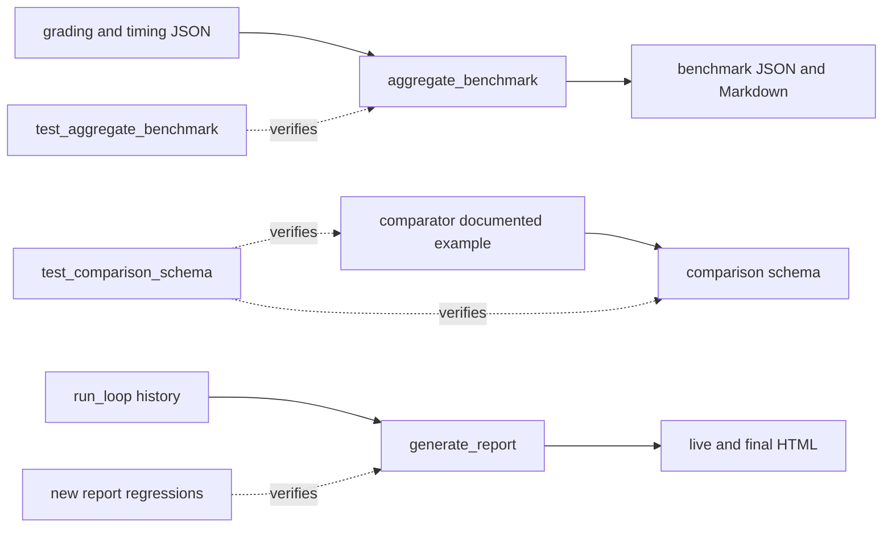

# Python report and regression review

## Result

Reviewed the three requested working files and repaired the verified upstream
defects they exposed. Final scores are **96-97/100**, above the requested
95-point threshold. **Pressure status: AMBER** because Sonar quality analysis, a
completed independent final review, and execution on Python 3.10 are
unavailable. Numeric scores do not imply production readiness.

All six scoped code/document changes are in the original workspace. Existing
unrelated edits were preserved. No schema definitions or repository policies
were changed. No commit or deployment was performed.

## Artifact and diagnostic provenance

- Date: 2026-10-05, Australia/Sydney.
- Base revision: `ef53dd8f9700bfd6064b956a098a345ae1d8154c`.
- Reviewed artifacts: current working copies, including pre-existing edits.
- Requested diagnostic rule IDs were not supplied. Findings below come from
  fresh executed tests, analyzers, and source inspection.
- Baseline: 22 benchmark tests passed; comparison tests had two JSON parsing
  errors. Pyright passed. Ruff reported five modernization diagnostics in
  `generate_report.py`. Initial mypy failures concerned missing JSON Schema
  stubs and an unresolved test-only import.
- Isolation: `.worktrees/python-report-review`, populated from the current
  working files rather than reverting their existing changes.
- Original checkpoint hashes were verified before transfer; transferred files
  were verified against the tested candidates by SHA-256 equality.

## Architecture, purpose, goal, and expected outcome

These files support two separate evaluation paths. Benchmark aggregation and
blind comparison are distinct from trigger-description optimization.

### `test_aggregate_benchmark.py`

- Architecture: unittest cases create real temporary evaluation workspaces and
  exercise the aggregator's public API and CLI entry point.
- Purpose: prevent fabricated metrics, ambiguous comparisons, incorrect grading
  statistics, ordering regressions, and invalid output behavior.
- Goal: preserve observable grading evidence and recover independent optional
  measurements without converting missing values into zero.
- Expected outcome: deterministic benchmark JSON/Markdown, explicit incomplete
  coverage, accurate statistical counts and comparison deltas, and controlled
  errors for unusable grading evidence.
- Change: fixed the test-only type import and added field-recovery, precedence,
  zero-value, overflow, and downstream summary/delta regressions.

### `test_comparison_schema.py`

- Architecture: unittest cases load the canonical Draft 2020-12 schema, validate
  persisted comparison fixtures, and strictly parse the documented example.
- Purpose: protect the comparator's A/B output contract and optional expectation
  results.
- Goal: keep producer documentation consistent with the persisted schema and
  scoring/count arithmetic.
- Expected outcome: valid examples, both comparison sides present, unsupported
  ties rejected, shared rubric criteria, accurate dimension means, and matching
  quality scores and expectation counts.
- Change: introduced a typed validated-example boundary, checked schema
  validity, and extended arithmetic/shared-criteria assertions. The existing
  failing example tests correctly exposed the upstream defect; strict JSON
  parsing was retained.

### `generate_report.py`

- Architecture: JSON input is validated into immutable records, query columns
  are collected deterministically, rendering helpers produce escaped HTML, and
  the CLI controls file/stdin input and file/stdout output.
- Purpose: show description attempts, training evidence, held-out evidence, and
  the chosen description during optimization and after completion.
- Goal: faithfully render the optimizer's frozen selection without using holdout
  results to choose another winner or inventing missing evidence.
- Expected outcome: live reports accept pending holdout results, final reports
  highlight the training-selected row, missing observations remain neutral, and
  malformed input produces a controlled CLI error.
- Change: normalized only null holdout arrays, aligned winner selection with
  training evidence, added neutral missing-result/score rendering, validated
  summary scalar types and finite scores, and modernized supported annotations.

## Frozen 100-point rubric

The weights were recorded before remediation. These are engineering review
judgments, not measured percentages of all possible inputs. Any unresolved
material behavioral defect overrides the readiness implication of a score.

| Criterion                              | Maximum | Full-credit standard                                       |
| -------------------------------------- | ------: | ---------------------------------------------------------- |
| Runtime and semantic correctness       |      25 | Evidence and displayed conclusions agree.                  |
| Type architecture                      |      20 | Validated models support fresh type checks.                |
| Boundary validation and error handling |      15 | Invalid data fails safely; valid siblings survive.         |
| Static-analysis quality                |      15 | Applicable fresh diagnostics are addressed.                |
| Maintainability and complexity         |      10 | Responsibilities remain clear and fixes minimal.           |
| Determinism and performance            |       5 | Ordering and selection are stable; work is proportional.   |
| Compatibility and CLI preservation     |       5 | Valid existing contracts and options are retained.         |
| Verification evidence                  |       5 | Runtime, pressure, and compatibility claims are exercised. |
| **Total**                              | **100** |                                                            |

| Criterion               | Benchmark before/after | Comparison before/after | Report before/after |
| ----------------------- | ---------------------: | ----------------------: | ------------------: |
| Runtime correctness /25 |                23 / 25 |                 23 / 25 |             10 / 25 |
| Type architecture /20   |                18 / 20 |                 14 / 20 |             16 / 20 |
| Boundaries /15          |                11 / 15 |                 11 / 15 |              9 / 15 |
| Static analysis /15     |                14 / 14 |                 14 / 14 |             12 / 14 |
| Maintainability /10     |                 9 / 10 |                  8 / 10 |               8 / 9 |
| Determinism /5          |                  5 / 5 |                   5 / 5 |               4 / 5 |
| Compatibility /5        |                  5 / 5 |                   5 / 5 |               2 / 5 |
| Evidence /5             |                  3 / 3 |                   2 / 3 |               1 / 3 |
| **Total /100**          |            **88 / 97** |             **82 / 97** |         **62 / 96** |

Static-analysis points reserve one point for unavailable Sonar quality analysis.
Final evidence reserves points for missing Python 3.10 runtime and completed
independent final review. The report retains inline HTML/CSS, a minor
maintainability cost intentionally preserved for compatibility.

## Verified findings and upstream/downstream impacts

### F1: Pending holdout evidence crashes reports

- Priority/classification: P0, verified defect.
- Upstream: `run_loop._make_history_entry` writes `test_results: null` until
  selection is frozen and holdout evaluation runs once.
- Root cause: `_parse_iteration` passed null to array validation.
- Downstream: live report writing raised `ValueError`; final histories with
  untested rows also failed.
- Repair: interpret null holdout evidence as no observations while retaining
  rejection of wrong array types and null training evidence.
- Protection: live and final output integration tests use the actual producer
  helpers, without calling an external model.

### F2: Report chooses a different winner and fabricates failures

- Priority/classification: P0, verified defect.
- Upstream: the optimizer freezes the first maximum training-pass candidate.
- Root cause: report selection switched to holdout passes whenever a holdout
  query existed; missing observations became failed zero-run results.
- Downstream: the report highlighted an incorrect description when the chosen
  candidate failed holdout, and untested candidates appeared to fail.
- Repair: select from training verdicts with stable first-seen ties and show
  missing/zero-run cells and aggregates as `Not evaluated`.
- Protection: failed holdout, stable ties, missing query, observed failure, and
  final producer-output regressions.

### F3: Invalid timing sibling discards valid measurements

- Priority/classification: P1, verified defect.
- Upstream: optional duration and tokens can be independently available in
  `timing.json`; grading duration takes precedence, including explicit zero.
- Root cause: `aggregate_benchmark.load_timing_file` validated both fields in
  one exception boundary.
- Downstream: a malformed token count removed valid duration, or malformed
  duration removed valid tokens. Statistical samples and cost/time comparisons
  silently lost usable evidence.
- Repair: validate duration and tokens independently; retain numeric guards,
  warning behavior, and grading-duration precedence.
- Protection: both invalid-sibling directions, zero, huge token integers,
  precedence, and recovered duration reaching summary count/mean and delta.

### F4: Documented comparator JSON is invalid

- Priority/classification: P1, verified defect.
- Upstream: `agents/comparator.md` contained physical newlines inside its quoted
  JSON reasoning value.
- Downstream: strict parsing failed in two existing tests; copied examples could
  produce invalid persisted comparisons.
- Repair: put the reasoning in one valid JSON string, preserving its text and
  the contract. Do not relax parsing or change the schema.
- Protection: existing strict example parsing plus scoring/count tests.

### F5: Summary model accepts invalid values

- Priority/classification: P1, verified boundary-validation defect.
- Root cause: summary values were arbitrary `object` fields rather than typed,
  validated display values and counts.
- Downstream: reports could display NaN/infinity, booleans as scores/counts,
  negative iteration counts, or collections as score metadata.
- Repair: allow score strings and finite numbers; require supplied counts to be
  nonnegative integers. Preserve missing-field defaults and valid numeric zero
  values.
- Protection: malformed scalars, non-finite values, HTML escaping, and CLI error
  handling tests.

## Fresh verification

- Python 3.14.7: **79 scoped tests passed**, including 25 benchmark, seven
  comparison, 13 report, 19 run-evaluation, and 15 existing script regressions.
- All five touched Python files compile and parse with Python 3.10 grammar.
- Ruff 0.16.7: lint and format checks passed for all five touched Python files.
- mypy 2.3.1: five files passed with repository configuration and
  `--follow-imports=silent --python-version 3.10`.
- Pyright 1.1.414: zero errors and warnings for those same five files.
- JSON Schema 4.26.0: persisted fixtures and documented example validated.
  Missing `types-jsonschema` stubs were installed into the local Python user
  environment; repository dependencies were unchanged.
- CLI coverage: file/stdin input, HTML output, invalid JSON, wrong root/history
  types, and missing input; failures return 2 without tracebacks.
- Report compatibility: six fully observed fixture/options combinations produced
  byte-identical old/new HTML.
- Benchmark compatibility: 18 valid runs produced identical JSON and Markdown
  apart from the expected wall-clock timestamp.
- Secrets scans passed before source reads and for scoped candidate files.

## Limitations and compatibility impact

Sonar CLI 1.7.0 reported Vortex analysis unavailable and skipped quality
analysis. Its successful secrets scan is separate evidence. No final Sonar
quality pass is claimed. The independent debugger verified root causes; the
post-change reviewer hit an account usage limit before completing its review.
Final local verification does not replace that missing independent evidence.
Python 3.10 was unavailable for execution; grammar and mypy target checks do not
prove runtime compatibility on that interpreter. Full portal/UI suites were
outside this Python-tooling scope.

Persisted schemas, public CLI options, and valid observed output remain
compatible. Intended behavior changes are acceptance of the producer's null
holdout state, corrected selection/missing displays, independent recovery of
valid measurements, and rejection of malformed summary values. The private
report selection helper no longer offers holdout-based selection.

The threshold is satisfied for the reviewed files. The AMBER evidence status and
remaining validation gaps must accompany any readiness decision.

## Follow-up: supplied Pylance and SonarLint diagnostics

The user supplied editor findings after the original review. The earlier basic
Pyright invocation did not reproduce the user's global strict Pylance setting or
workspace-root import resolution. Its clean result was insufficient evidence for
editor cleanliness; the original completion claim was too broad.

The supplied findings were confirmed against the current regression files:

- `test_generate_report.py`: the runtime `sys.path` change could not establish
  static imports from the skill's `scripts` package, which also collided with
  the repository's top-level `scripts` directory. Unknown module types cascaded
  through report generation, history records, and assertions. Explicit sibling
  file loading now uses typed structural interfaces for the public APIs. Tests
  exercise public `run_loop.run_loop` instead of private helpers, with the model
  calls replaced by deterministic evidence. Mixed and invalid fixtures have
  explicit container types.
- `test_aggregate_benchmark.py`: heterogeneous grading dictionaries and timing
  case tables lacked context for strict inference. Explicit JSON-fixture and
  case-table annotations remove the unknown types without changing the hostile
  values or their assertions. The unsupported-configuration fixture no longer
  depends on a test-only import that is ambiguous at the workspace root.
- `test_comparison_schema.py`: the dependency's permissive `validate` stub was
  partially unknown under strict checking. A narrow structural protocol records
  the actual single-argument API exercised by the tests. Computed score and
  pass-rate comparisons now use `assertAlmostEqual` with its seven-place
  default, addressing supplied `python:S5906` findings without changing the
  expected rounded scores.

The installed Python 3.11 environment lacked `jsonschema` source and PyYAML.
Installed `jsonschema`, `types-jsonschema`, and PyYAML in that interpreter's
user environment; repository dependency declarations and editor settings were
not changed. Python 3.14 already had the runtime dependencies.

### Follow-up verification

- All **79 scoped tests pass on Python 3.14 and Python 3.11**.
- Pyright 1.1.414: **zero errors and warnings** for the three corrected files
  using strict mode, the workspace execution root, and no added import paths.
  Mixed-container inference was also disabled in the test configuration to
  exercise the supplied unknown-container diagnostics. The same check passed
  with Python 3.11 explicitly selected for dependency resolution.
- mypy 2.3.1 with a Python 3.10 target: all three corrected files pass.
- Ruff lint and format checks pass; files compile and parse as Python 3.10.
- Independent final review found no material flaw or weakened regression
  coverage and independently ran all 45 focused tests successfully.

The structural module protocols are honest boundaries for dynamically imported
scripts. They describe the signatures exercised by the tests; they do not claim
that a static analyzer proves the complete implementation conforms to a module
protocol. Actual public calls and integration tests verify the exercised APIs.
No production scripts, persisted schemas, or quality rules changed in this
follow-up. Existing hostile-input coverage was retained.

The Pylance findings were verified with a strict Pyright reproduction rather
than a fresh VS Code Pylance session. SonarLint's editor analysis was not rerun;
the supplied floating-point assertion patterns were repaired, while Sonar
quality-analysis availability and the Python 3.10 runtime limitation remain as
reported above. This follow-up supersedes the earlier type-cleanliness claim for
the three regression files.
