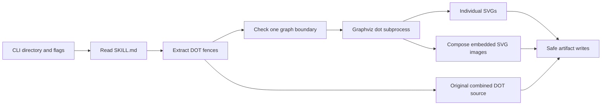

# Graph renderer architecture and quality assessment

Date: 2026-10-05 (Australia/Sydney).

Scope: [render-graphs.js](../../skills/writing-skills/scripts/render-graphs.js)
and its documentation, subprocess boundary, artifacts, and regression tests.
This is a script assessment, not a release-readiness verdict for the whole
writing-skills package.

## Verdict

Initial assessment: **88/100**. The implementation was below the requested
95-point threshold, so it was refactored. Revised assessment: **97/100**. These
are evidence-based reviewer scores under the rubric below, not scores returned
by SonarQube. The architecture is appropriate for a local CLI.

The original rendering and filesystem safeguards were substantial. The main
weakness was the combined lexical state machine: cognitive complexity 57 made
changes to comment, quoted-label, HTML, and brace handling difficult to review.
The refactor separates those responsibilities without adding dependencies to the
skill or changing its documented CLI/output contract.

## Purpose, goal, and expected outcome

**Purpose:** make fenced DOT flowcharts in a skill's `SKILL.md` available as
visual documentation without manually copying each graph into Graphviz.

**Goal:** preserve the declared diagrams, labels, layout, and independent graph
identifiers while producing portable files and reporting failures explicitly.

**Expected outcome:** individual SVG files in `<skill>/diagrams/`, or one
vertically composed SVG plus the original multi-graph DOT source with
`--combine`. Every successful SVG represents a complete rendered graph. Invalid
arguments, malformed fences, invalid DOT, Graphviz diagnostics, and
unsafe/write-failing outputs produce exit code 1. No DOT blocks produce exit
code 0 without creating an output directory. Separate mode can retain valid
outputs when another diagram fails; writes are atomic per file, not per run.

## Architecture as implemented

The script is a native ESM, synchronous Node CLI using only Node built-ins and
an external Graphviz executable. It has no application-runtime imports or
exported library API. Synchronous execution is reasonable for this bounded
documentation task; introducing workers or a parser framework is unnecessary.



| Responsibility                      | Implementation evidence                                                                |
| ----------------------------------- | -------------------------------------------------------------------------------------- |
| CLI and orchestration               | `main`, renderer line 339                                                              |
| Fence identification and extraction | `readFence`, `isClosingFence`, `dotBlock`, `extractDotBlocks`, lines 31–78             |
| Lexical graph boundary              | `assertOneGraph`, line 160; focused quoted-string, HTML, and trivia helpers            |
| Grammar and layout                  | `runDot`, line 186; Graphviz receives DOT on stdin with `-Tsvg`                        |
| Executable discovery                | `resolveDotExecutable`, line 212; absolute environment override and standard locations |
| Portable collision-free names       | `trimBoundaryDots`, `portableStem`, `uniqueStems`, lines 232–261                       |
| Output containment and replacement  | `prepareOutputDirectory`, `writeArtifact`, lines 264–302                               |
| Combined presentation               | `combineSvgs`, line 304; independent base64 SVG documents                              |

Graphviz owns DOT grammar, attributes, and layout. The handwritten scanner only
enforces one complete graph boundary while treating comments and strings as
opaque. This division avoids maintaining a second full DOT parser.

The subprocess uses argument arrays rather than shell interpolation, a 30-second
timeout, and a 10 MiB output limit. Nonempty Graphviz stderr is a failure,
including warnings. Output directories and files reject links, and replacement
uses a new local temporary file followed by rename.

## Upstream and downstream impacts

| Boundary             | Upstream dependency                                                                                                                                         | Downstream consequence and refactor impact                                                                                                                                                                           |
| -------------------- | ----------------------------------------------------------------------------------------------------------------------------------------------------------- | -------------------------------------------------------------------------------------------------------------------------------------------------------------------------------------------------------------------- |
| Invocation           | [Harness README](../../skills/writing-skills/scripts/README.md), lines 155–196; [reference index](../../skills/writing-skills/references/index.md), line 50 | Existing command syntax, flags, diagnostics, exit semantics, and artifact locations remain supported. No caller changes are required.                                                                                |
| Markdown extraction  | Authors provide matching DOT fences in `SKILL.md`                                                                                                           | Incorrect extraction could omit diagrams or render examples inside another language. Marker scanning and fence characterization tests protect this boundary.                                                         |
| DOT validation       | Extracted content and the executable-discovery probe enter `runDot`                                                                                         | A scanner regression could reject valid labels/subgraphs, accept surplus graphs, or make executable discovery fail. Quote/comment/HTML helpers and real Graphviz tests exercise both normal rendering and the probe. |
| Graphviz execution   | Installed executable, `GRAPHVIZ_DOT`, and DOT input                                                                                                         | Grammar/layout remain Graphviz responsibilities. Timeout, output cap, stderr handling, and invocation style were retained.                                                                                           |
| Artifact naming      | Graph names and skill-directory basename                                                                                                                    | Filename cleanup feeds separate SVGs and combined artifact names. Boundary-dot trimming changed implementation, while reserved names and collision handling remain covered.                                          |
| Artifact consumption | Documentation readers and SVG/image consumers                                                                                                               | Independent embedded documents preserve labels and namespaces. Existing combined-image presentation, external-image rejection, and DOT companion semantics were retained.                                            |
| Regression harness   | [Renderer tests](../../skills/writing-skills/scripts/tests/test_render_graphs.py) launch the CLI                                                            | Added behavioral coverage; concurrent UTF-8 decoding and label-helper improvements were preserved. Tests exercise real subprocesses and parse real SVG output.                                                       |
| Portal runtime       | No portal import or package-script invocation was found in the inspected references                                                                         | No app routes, components, auth, generated API code, or frontend build contracts changed.                                                                                                                            |

TokenSave callers and impact queries confirm the internal chain
`assertOneGraph → runDot → main / resolveDotExecutable`. These graph results
were checked against the actual source. The initial graph was rebuilding; source
inspection remains the authority for current behavior.

## Findings, causes, and corrections

| Supplied finding                   | Cause and impact                                                                                                                                            | Correction                                                                                                            | Evidence                                                                                               |
| ---------------------------------- | ----------------------------------------------------------------------------------------------------------------------------------------------------------- | --------------------------------------------------------------------------------------------------------------------- | ------------------------------------------------------------------------------------------------------ |
| S3776: `extractDotBlocks`, 17 > 15 | Nested fence state, graph extraction, and naming made author-input handling harder to change safely.                                                        | Extract fence/block helpers and use early continuation for separate parser states.                                    | Local SonarJS measures 14.                                                                             |
| S6557: prefix comparison           | Marker-character equality plus a length comparison manually expressed a prefix operation. Incorrect replacement could accept a shorter or mismatched fence. | Use `closing?.marker.startsWith(fence.marker)` on markers consisting of one repeated character.                       | Source inspection and short/mismatched/long-fence tests; editor rule revalidation remains unavailable. |
| S8786: opening-fence regex         | Adjacent variable-length matching caused an analyzer backtracking finding on author-controlled lines.                                                       | Bounded indentation lookup followed by a forward marker scan and string slicing.                                      | Local SonarJS reports no S8786 finding; 20,000-character matching fences render successfully.          |
| S3776: `assertOneGraph`, 57 > 15   | One loop mixed six lexical states with structural validation. A small change could alter graph boundaries or labels.                                        | Focused skip helpers for DOT trivia, quoted strings, HTML strings/attributes/comments, plus a cursor loop for braces. | Local SonarJS measures 12; every function is at most 14.                                               |
| S2310: assignment to `i`           | A `for` counter was also moved inside HTML-comment processing, making advancement hard to reason about.                                                     | Explicit cursor-based `while` scanning; skip helpers return the next unread position.                                 | Local SonarJS reports no S2310 finding; comment and incomplete-input cases pass.                       |
| S8786: filename-dot regex          | Unanchored suffix matching had a structural backtracking finding. Runtime exposure was already bounded by the 80-character stem cap.                        | Advance boundary indices and slice once.                                                                              | Local SonarJS reports no S8786 finding; boundary dots, empty stems, and reserved names pass.           |
| 24 `prettier/prettier` errors      | Trailing commas and multiline operator placement differed from the current formatter configuration. Each requested edit became a separate diagnostic.       | Format this file with the existing configuration.                                                                     | Targeted ESLint and Prettier checks pass.                                                              |

The complexity and regex findings describe maintenance/performance concerns;
they do not establish that all diagrams were broken. The original 19 tests
passed. No practical filename-regex denial of service was demonstrated because
the stem is capped before trimming. The change removes the flagged pattern
without exaggerating its prior exposure.

The root `lint` script in `package.json` targets app, Storybook, test, and root
config globs; it does not include this skill script. Its explicit ESM entry in
`eslint.config.mjs` configures parsing when linted, but does not cause the root
lint command to select it. That explains how formatting diagnostics could remain
despite unrelated app validation. No lint policy was changed here.

## Rubric out of 100

| Category                                   | Maximum | Full-credit criterion                                                                                         | Before |  After |
| ------------------------------------------ | ------: | ------------------------------------------------------------------------------------------------------------- | -----: | -----: |
| Architecture and responsibility boundaries |      20 | Cohesive CLI, clear dependency direction, grammar owned by Graphviz, understandable orchestration             |     17 |     19 |
| Correctness and artifact fidelity          |      25 | Matching fences, one graph per block, preserved labels/namespaces, portable output, explicit failure behavior |     24 |     25 |
| Maintainability and static quality         |      20 | Functions at complexity ≤15, explicit scanning progression, no supplied lint patterns, readable helpers       |     14 |     19 |
| Performance and resource handling          |      10 | Linear flagged scanning/cleanup, bounded subprocess output/time, no unnecessary architecture                  |      9 |     10 |
| Execution and filesystem safety            |      10 | No shell interpolation, link rejection, contained naming, atomic file replacement and cleanup                 |     10 |     10 |
| Verification and regression evidence       |      10 | Real boundary/artifact tests, static checks, independent review and representative platform evidence          |      9 |      9 |
| Purpose and documented outcome             |       5 | Commands, dependencies, failure exits, partial-output and combined-mode limitations are explicit              |      5 |      5 |
| **Total**                                  | **100** |                                                                                                               | **88** | **97** |

Remaining deductions reflect reviewer judgment: orchestration still lives in one
CLI file, helpers require familiarity with DOT lexical conventions, and
independent reviewer/platform/editor verification is incomplete. These are not
reasons to add a dependency or broaden this refactor.

## Verification performed

- Original behavioral baseline: **19 passed**.
- Expanded characterization baseline before implementation: **34 passed**.
- Refactored isolated implementation: **34 passed**.
- Final merged workspace implementation, including the concurrent UTF-8 test:
  **35 passed**. New cases protect HTML/comments, nested subgraphs, incomplete
  DOT, fence mismatches, examples inside another language, long marker lines,
  and portable boundary/reserved filenames.
- Targeted ESLint: clean. Prettier: clean. Node syntax check: clean.
- Ruff lint and formatting checks: clean after formatting the new tests.
- Deterministic secrets scans: no issues in changed source/test files.
- Local `eslint-plugin-sonarjs` **4.2.2** reproduced five supplied findings
  before refactoring and reports none afterward for S3776, S2310, and S8786.
  Measured parser complexity changed **17 → 14** and **57 → 12**.

Commands used from the repository root:

```powershell
python -m pytest skills/writing-skills/scripts/tests/test_render_graphs.py -q -p no:cacheprovider --basetemp .worktrees/render-graphs-pytest-final-formatted --tb=short
node node_modules/eslint/bin/eslint.js skills/writing-skills/scripts/render-graphs.js
node node_modules/prettier/bin/prettier.cjs --check skills/writing-skills/scripts/render-graphs.js
node --check skills/writing-skills/scripts/render-graphs.js
ruff check skills/writing-skills/scripts/tests/test_render_graphs.py
ruff format --check skills/writing-skills/scripts/tests/test_render_graphs.py
node .worktrees/render-graphs-review/check-sonar.cjs skills/writing-skills/scripts/render-graphs.js
```

The local analyzer and its temporary packages are isolated under ignored
`.worktrees/render-graphs-review`; repository dependencies and policy were not
changed. Existing uncommitted work and concurrent changes were preserved.

## Verification limits

Server-side `sonar analyze --file ...` returned **403 Forbidden**; the complete
connected Sonar/editor profile was not rerun. S6557 was verified by inspecting
the `startsWith` replacement and exercising fence behavior; the local plugin
does not expose that rule. Independent code/security/Python reviewers were
requested under repository policy but failed because of capacity limits. The
debugger supplied partial contract observations before its usage limit. The
final review and score are therefore the primary agent's assessment.

Execution evidence is from Windows with installed Node and Graphviz. Linux and
macOS were not executed. SVGs were structurally parsed, including embedded
graphs and labels; visual screenshots across SVG viewers were not tested.
App-wide tests/builds were not run because no app code or build behavior
changed.

Automatic approval review rejected removal of task-created pytest temporary
directories with "blocked by policy." Those artifacts remain under ignored
`.worktrees/render-graphs-pytest-*`; cleanup was not claimed as completed.
