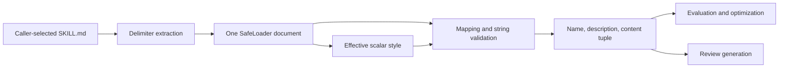

# Skill metadata parser assessment

Review date: 5 October 2026, Australia/Sydney.

The current working copy of `.claude/skills/skill-creator/scripts/utils.py`
scored **71/100** before repair and **96/100** after repair. The authorized
refactor is applied to the original workspace. Pressure status is **AMBER**:
executed behavior, compatibility, types, and lint checks pass, but the exact
Sonar complexity rule and editor Pylance run could not be verified freshly.

## Purpose, goal, and expected outcome

This module reads `SKILL.md` from a caller-selected skill directory. Its public
interface is:

```python
parse_skill_md(skill_path: Path) -> tuple[str, str, str]
```

It returns the skill name, description, and complete decoded content. The goal
is reliable metadata extraction for trigger evaluations, description
optimization, and review generation. Expected outcomes are string metadata,
preserved YAML precedence, correct scalar/newline handling, and bounded errors
for malformed YAML.

The reader intentionally defaults absent fields and empty/null frontmatter to
empty strings. Required-field and deployable-name validation belongs to
`quick_validate` and execution consumers. Explicit null, numeric, boolean, or
collection metadata is rejected. UTF-8 file errors still propagate to callers.
Complete content uses the existing `Path.read_text` newline normalization; it is
not a byte-for-byte copy.

## Architecture

The original function combined delimiter discovery, two independent YAML parses,
shape checks, metadata projection, and style normalization. One parse
constructed data; the other retained an unresolved node tree. Those views
disagreed about duplicate keys and merges.

The refactor separates cohesive responsibilities and constructs one SafeLoader
document. A small loader subclass retains the root node used by
`get_single_data`; normal SafeLoader construction still resolves aliases,
merges, tags, and duplicate keys. Style lookup runs after construction and
selects the last effective description node.



YAML values remain `object` until validated. Documented casts narrow library
boundary representations: a checked dictionary to `dict[object, object]`, and
MappingNode entries to node pairs. They do not declare unvalidated metadata to
be strings or suppress diagnostics. The loader is disposed in `finally` after
successful initialization.

## Fixed 100-point rubric

Weights were frozen before remediation. Scores reflect the stated module scope
and engineering judgment; they are not a production certification. Any
unresolved material behavioral defect overrides the numeric score.

| Criterion                          | Maximum | Before |  After | Evidence and deduction                                                |
| ---------------------------------- | ------: | -----: | -----: | --------------------------------------------------------------------- |
| Runtime correctness                |      25 |     20 |     25 | Duplicate/merged newline defects reproduced and corrected             |
| Type architecture                  |      20 |     14 |     20 | Six strict Unknown diagnostics reproduced; final zero                 |
| Boundary validation/error handling |      15 |     10 |     15 | Four malformed-tag exception escapes repaired                         |
| Static-analysis quality            |      15 |      9 |     13 | Ruff and strict Pyright pass; exact Sonar result unavailable          |
| Maintainability/complexity         |      10 |      7 |     10 | Cohesive helpers replace one mixed-responsibility function            |
| Determinism/performance            |       5 |      3 |      5 | One YAML parse; consistent effective-key precedence                   |
| Compatibility/API preservation     |       5 |      5 |      5 | Tuple/defaults retained; differential and consumer checks pass        |
| Verification evidence              |       5 |      3 |      3 | Runtime/pressure evidence strong; exact editor/Sonar evidence missing |
| **Total**                          | **100** | **71** | **96** | Above 95 after the authorized refactor                                |

## Findings and root causes

### F1: Effective description and scalar style disagreed

Priority P1; verified behavioral defect. Original `utils.py:35` composed a
second YAML tree and lines 56–64 searched it for the first block description.
Constructed data followed last-key-wins semantics, while style lookup could
follow an earlier key or miss merged values.

| Fixture                                             | Before          | Corrected     |
| --------------------------------------------------- | --------------- | ------------- |
| Block description, then quoted duplicate `"last\n"` | `"last"`        | `"last\n"`    |
| Block description inherited by merge                | `"inherited\n"` | `"inherited"` |
| Merge sequence whose winning description is a block | Untrimmed block | Trimmed block |

Impact: evaluation inputs, optimization history/prompts, and generated review
metadata could contain altered description text. Repair uses the same
constructed document and effective node precedence. Regression tests cover
duplicate quoted/block descriptions, aliases, merge sequences, and explicit
overrides in both key orders.

Compatibility: intentional corrections only; duplicate keys remain accepted with
PyYAML precedence. No tuple, schema, or caller change.

### F2: Malformed standard YAML tags bypassed bounded errors

Priority P1; verified behavioral and diagnostic-disclosure defect. Original
`utils.py:36` caught YAML/ValueError/RecursionError but PyYAML 6.0.3 raises
other builtins for malformed explicitly tagged values:

| Synthetic scalar             | Original exception             |
| ---------------------------- | ------------------------------ |
| `!!bool private-marker`      | KeyError, including input text |
| `!!timestamp private-marker` | AttributeError                 |
| `!!int ""`                   | IndexError                     |
| `!!float ""`                 | IndexError                     |

Impact: these exceptions bypass callers that catch `ValueError`, can terminate
evaluation/review workflows, and may expose YAML values in tracebacks. Repair
normalizes these demonstrated constructor errors only at the YAML dependency
boundary. Messages do not incorporate raw exception text and suppress exception
chaining. Marked errors retain numeric source locations, adjusted for the
opening frontmatter line.

Regression: all four tag cases were observed failing before repair and now
produce bounded `ValueError`. This changes malformed-input failure types
intentionally without changing valid YAML results.

### F3: Incomplete YAML typing propagated to metadata

Priority P1; verified analyzer defect under strict Pyright. All six supplied
Pylance diagnostics were reproduced on the preserved working copy at the
matching lines: Unknown `frontmatter_node`, partially Unknown `compose`, Unknown
`name` and `description`, and partially Unknown `get`.

Upstream cause: PyYAML's type stubs leave low-level `compose` and node entry
representations incomplete; dictionary narrowing alone does not describe its
key/value types. Installing current types-PyYAML alone did not clear the
original six errors. The refactor uses the typed single-document loader API and
validated object boundaries.

Impact: runtime validation already protected ordinary metadata, but static
analysis could not verify the parser's intermediate model. Fresh strict Pyright
reports zero errors, warnings, or information diagnostics for the final
original-workspace file.

### F4: Mixed responsibilities caused the complexity finding

Priority P2; supplied Sonar `python:S3776` finding: complexity 21, threshold 15,
original function at line 13. The source location matches the reviewed
pre-refactor artifact. Analyzer version, timestamp, and complete quality profile
were not supplied.

Repair extracts delimiter handling, safe YAML construction, and effective-style
lookup. The public parser now coordinates validated steps. This structurally
addresses the finding; no homemade complexity count is presented as a Sonar
result. Fresh Sonar CLI full analysis failed with `403 Forbidden` because Vortex
analysis is unavailable on the configured connection. Final S3776 clearance
remains unverified.

## Upstream and downstream impact

| Boundary                     | Impact and preserved protection                                                                                                                       |
| ---------------------------- | ----------------------------------------------------------------------------------------------------------------------------------------------------- |
| Upstream SKILL.md authoring  | Aliases, merges, quoted escapes, block scalars, duplicate keys, and empty defaults remain supported                                                   |
| Upstream PyYAML              | One SafeLoader parse; incomplete library node typing narrowed locally; malformed constructor errors normalized                                        |
| `run_eval.py:1229`           | Receives corrected description; catches ValueError/OSError/RuntimeError; validates names before temporary paths and safely quotes YAML                |
| `run_loop.py:624`, `:770`    | Original description/history and evaluation inputs receive consistent text; return tuple unchanged                                                    |
| `generate_eval_review.py:58` | Review payload uses corrected metadata; script JSON escapes `<`, `>`, `&`; malformed YAML becomes controlled CLI failure                              |
| `improve_description.py:642` | Name and complete content remain compatible; parser ValueError can still surface as a traceback because this call sits outside its JSON-error handler |
| Portal React application     | No runtime dependency on this skill-tooling parser was identified; no application source was changed                                                  |

Caller locations were confirmed in source after graph queries. TokenSave
reported a stale editor-settings entry and was rebuilding during some queries;
fresh source inspection, not graph freshness alone, established the
relationships.

## Fresh verification

The pre-edit working copy was already modified by the user. It was checkpointed,
copied into an ignored worktree, reviewed there, and then copied back only after
checking root baseline hashes for concurrent changes. No user changes were
reset. No commits or pushes were made.

The task worktree remains at `.worktrees/skill-utils-review-20261005`. Execution
policy rejected the cleanup command; ordinary Git removal refused because it
contains modified/untracked copies. The verified changes are already in the
original workspace, and recovery checkpoints remain available outside it.

Original working-copy SHA-256:

```text
38DB2A892D092043C8AEBA04AA38C0CEAEDDEC8DFBB5175E86296B6DD626086A
```

Verified final `utils.py` SHA-256:

```text
78E53CC09847C899A2778496783AA437EDBAD951B3AD5161046BEFDCF3BEEF74
```

| Gate                           | Fresh result                                                                                       |
| ------------------------------ | -------------------------------------------------------------------------------------------------- |
| Original parser baseline       | 11/11 tests pass; compile succeeds                                                                 |
| RED before repair              | Three newline failures and four malformed-tag subcase errors reproduced                            |
| Final parser tests             | 21/21 pass on Python 3.14.7 and Python 3.10.19                                                     |
| Evaluation regression tests    | 19/19 pass                                                                                         |
| Review generation tests        | 19/19 pass                                                                                         |
| Real Chromium review UI tests  | 2/2 pass                                                                                           |
| Validator compatibility tests  | 9/9 pass                                                                                           |
| Shared script regressions      | 15/15 pass                                                                                         |
| Final root regression total    | 85/85 pass on Python 3.14.7                                                                        |
| Compile                        | Final parser and edited tests compile                                                              |
| Ruff 0.16.7                    | Check and format check pass for both edited Python files using root config                         |
| Pyright 1.1.414                | Strict, Python version 3.10; 1 file analyzed, zero diagnostics                                     |
| Compatibility differential     | 84 YAML fixtures plus CRLF, missing file, wrong file type, and consumer HTML agree                 |
| Deliberate corrections         | Two newline defect fixtures and all four malformed-tag exceptions verified                         |
| Consumer CLI                   | Success exit and identical escaped HTML for ordinary metadata                                      |
| Independent code/Python review | Approved; 24 additional valid differentials and 15 malformed cases exercised                       |
| Independent security review    | Approved for this parser refactor; malformed tags, unsafe tags, aliases, merges, and sinks checked |
| Secrets                        | Reviewed files scanned clean before inspection; final files scanned clean                          |
| Sonar CLI 1.7.0                | Secrets scan succeeds; full code analysis unavailable, 403                                         |
| Exact editor Pylance           | Not executed; strict Pyright reproduces and clears the supplied diagnostic types                   |

PyYAML runtime version: 6.0.3. types-PyYAML 6.0.12.20260906 was installed into
the existing user Python environment for review; no repository dependency
manifest changed. Python 3.10.19 and PyYAML were also resolved through an
isolated `uv run` environment.

Representative reproducible commands:

```powershell
python -m unittest discover -s '.claude/skills/skill-creator/scripts/Regression tests' -p test_utils.py -v
python -m unittest discover -s '.claude/skills/skill-creator/scripts/Regression tests' -p test_run_eval.py -q
python -m unittest discover -s '.claude/skills/skill-creator/scripts/Regression tests' -p test_generate_review.py -q
python -m unittest discover -s '.claude/skills/skill-creator/scripts/Regression tests' -p test_eval_review_ui.py -q
python -m unittest discover -s '.claude/skills/skill-creator/scripts/Regression tests' -p test_quick_validate.py -q
python -m unittest discover -s .claude/skills/skill-creator/scripts -p test_regressions.py -q
uv run --no-project --python 3.10 --with PyYAML==6.0.3 python -m unittest discover -s '.claude/skills/skill-creator/scripts/Regression tests' -p test_utils.py -q
ruff check --no-force-exclude .claude/skills/skill-creator/scripts/utils.py '.claude/skills/skill-creator/scripts/Regression tests/test_utils.py'
ruff format --check --no-force-exclude .claude/skills/skill-creator/scripts/utils.py '.claude/skills/skill-creator/scripts/Regression tests/test_utils.py'
```

Strict Pyright used a temporary configuration with a relative include for the
target file, `typeCheckingMode: "strict"`, and `pythonVersion: "3.10"`.
Repository/editor policies were not modified. Default Pyright also passed before
repair, so it alone was insufficient to establish that the strict supplied
diagnostics were fixed.

The initially sparse worktree lacked viewer/template dependencies; those setup
failures were resolved by copying the current files before rerunning affected
tests. Final test output includes expected negative fixture warnings; every
listed suite completed with `OK`.

## Follow-up: incomplete disposal typing

The user supplied an additional Pylance `reportUnknownMemberType` diagnostic at
the original refactor's line 46: `dispose` had type `() -> Unknown`. The earlier
strict Pyright environment used stubs that declare `Parser.dispose() -> None`,
so its clean result did not cover this editor dependency variant.

The exact diagnostic was reproduced by copying installed PyYAML stubs into a
temporary directory and removing only the return annotation on `Parser.dispose`.
This is a controlled reproduction of the supplied diagnostic, not a claim to
have run the exact editor configuration.

The repair adds `_DisposableLoader`, a protocol declaring `dispose() -> None`,
and narrows the existing loader to that cleanup interface at its `finally` call.
PyYAML's inspected runtime implementation clears parser state and implicitly
returns `None`. This additional cast describes that verified library contract.
It preserves the object, method dispatch, cleanup timing, and exception handling
without an override, diagnostic suppression, or dependency change.

Fresh checks against the updated original-workspace artifact:

- Strict Pyright: zero diagnostics with complete stubs and with the controlled
  incomplete-disposal stub; one target file analyzed in each.
- All 85 selected regressions pass on Python 3.14.7.
- All 21 parser tests pass on Python 3.10.19.
- Ruff check, format check, and compilation pass.
- The 84-fixture compatibility campaign and consumer CLI check pass.
- Independent debugger and code/Python review approve the narrow repair.

The rubric remains 96/100. Status remains AMBER because exact editor Pylance and
Sonar evidence is still unavailable. The SHA-256 above now identifies the
artifact including this disposal correction.

## Residual risks and follow-up

- `quick_validate.py:67–68` independently includes raw PyYAML exception text in
  validation messages. Security review reproduced source-marker disclosure with
  synthetic input. It does not call this parser, so this refactor cannot fix
  that adjacent path. A separate bounded-error repair is recommended; it was
  assessed but left outside the requested file.
- The parser has no file-size or YAML expansion limits. This predates the
  repair. This assessment covers local skill-tooling use, not an internet-facing
  untrusted-upload service. No new resource-limit policy was invented.
- `improve_description.py` can still show a bounded parser ValueError in a
  traceback. Its CLI exception-handling improvement is caller-owned.
- Exact Sonar S3776 and editor Pylance freshness remain unavailable. **96/100
  and AMBER** is the final module assessment; it does not imply the entire skill
  package or repository is ready for production.

## Primary reference checks

SafeLoader semantics were checked against
[PyYAML documentation](https://pyyaml.org/wiki/PyYAMLDocumentation). Strict
analysis configuration was checked against
[Microsoft Pyright configuration](https://github.com/microsoft/pyright/blob/main/docs/configuration.md).
Executed evidence above, rather than those documents, establishes the behavior
of this exact artifact.
