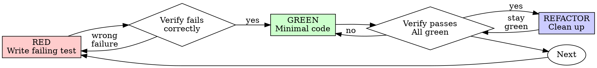

<!-- A Team fork. Merged from superpowers 6.3.0 on 2026-09-09. See .claude/docs/specs/2026-09-09-a-team-wiring-review-design.md -->

# Test-Driven Development

## Core rule

For new or corrected behavior:

**RED → GREEN → REFACTOR.**

Do not write or retain implementation that changes behavior until you have run a test that fails for the intended reason.

For a behavior-preserving refactor, first establish a passing behavioral baseline with existing tests or characterization tests, then refactor while keeping that baseline green.

A test for new or corrected behavior that was never observed failing does not prove it can detect the missing or broken behavior. A characterization test for existing behavior is different: it may pass immediately because its purpose is to record behavior that already exists.

### RED-GREEN-REFACTOR cycle

## Activation boundary

Use this discipline for implementation work that changes testable software behavior, including:

- new features;
- bug fixes;
- behavior-preserving refactors that need characterization or regression protection.

Do not force this workflow onto:

- prose-only documentation or comments;
- generated/vendor code that the project does not maintain directly;
- mechanical edits with no observable runtime behavior;
- work where automated execution is unavailable or impossible.

When a task falls outside the boundary, follow the project's applicable verification process instead of inventing a test.

## RED — prove the test detects the gap

Use RED for new behavior and bug fixes. Do not manufacture a failure for behavior that already exists solely to make a characterization test red.

1. Define one observable behavior.
2. Write the smallest test that expresses that behavior.
3. Run that test before implementing the behavior.
4. Confirm it fails for the expected reason.

A valid RED failure means the assertion exposes the missing or broken behavior. A syntax error, broken fixture, missing dependency, or unrelated failure does not count.

If the test passes unexpectedly, do not implement yet. Check whether:

- the behavior already exists;
- the bug was not reproduced;
- the test exercises the wrong path;
- the assertion is too weak.

Revise the test or understanding until the RED result is meaningful.

For a bug fix, first reproduce the bug with a regression test whenever practical.

## Characterization baseline — protect existing behavior

For a behavior-preserving refactor:

1. Identify the observable behavior that must remain unchanged.
2. Use existing passing tests when they already protect that behavior.
3. Add characterization tests when important existing behavior is not adequately protected.
4. Run the relevant tests before refactoring and confirm the baseline is green.

A new characterization test may pass immediately. That is valid when it records behavior that already exists and will be preserved. Do not alter production code or weaken the test merely to force RED.

If the task also changes or fixes behavior, use RED for that changed behavior before implementing it.

## GREEN — make only the required behavior pass

Implement the smallest change that satisfies the failing test.

Then run:

1. the focused test;
2. the relevant surrounding test set required by the project.

If a test still fails, diagnose the failure before broadening the implementation.

Do not add unrelated features, speculative edge handling, or refactors during GREEN.

## REFACTOR — improve structure while preserving behavior

After GREEN:

- simplify names, structure, duplication, or design as justified;
- add no new behavior during the refactor;
- rerun the relevant tests after each logical refactor step;
- restore GREEN before continuing if a regression appears.

Keep changes small enough that a failure can be attributed to a recent edit.

## Expand coverage one behavior at a time

Repeat RED → GREEN for additional cases that materially affect behavior, such as:

1. normal behavior;
2. boundaries or empty inputs;
3. invalid input and error paths;
4. dependency failures;
5. concurrency or ordering hazards when applicable.

Do not add edge cases mechanically. Add a test when the case is required by the specification, reproduces a defect, protects a material risk, or documents an important contract.

## Test design rules

When writing or changing any test, read [references/writing-good-tests.md](references/writing-good-tests.md).

Prefer tests of observable contracts:

- public APIs and externally visible behavior;
- business rules and decisions;
- data transformations;
- error behavior and side effects.

Avoid coupling tests to implementation details unless those details are themselves part of the required contract.

Use the project's established test level and dependency strategy. Mock, fake, stub, or use real dependencies according to the repository's conventions and the purpose of the test; do not introduce a universal mocking rule.

## Project policy takes precedence on mechanics

Use the repository's existing commands, test framework, coverage policy, fixtures, naming, and test organization.

Do not invent a coverage threshold. If the project defines a coverage gate, verify it after the change.

If no relevant test command or convention is known, inspect the repository before choosing one.

## Anti-rationalization rules

These do not justify skipping RED for new or corrected behavior:

- “The change is too small.”
- “I tested it manually.”
- “I will add tests afterward.”
- “The implementation is obvious.”
- “The existing code took too long to discard.”
- “We are in a hurry.”

If implementation that changes behavior was written before a meaningful RED test, do not claim TDD compliance for that behavior. Preserve work only when required for safety or recovery, but establish a failing test before using that implementation as the solution. This rule does not require a behavior-preserving refactor to manufacture RED when a valid green characterization baseline already exists.

## Common Rationalizations

| Excuse | Reality |
|--------|---------|
| "Too simple to test" | Simple code breaks. Test takes 30 seconds. |
| "I'll test after" | Tests written after pass immediately — which proves nothing. They may test the wrong thing, test the implementation instead of the behavior, or miss the edge case you forgot. You never watched it fail, so you never proved it can catch the bug. Test-first forces that failure. |
| "Tests after achieve same goals (spirit not ritual)" | Tests-after answer "what does this do?"; tests-first answer "what should this do?" Tests written after are biased by the code you already wrote — you verify the cases you remembered, not the ones you'd have discovered. Coverage without proof the tests work. |
| "Already manually tested" | Manual testing is ad-hoc: no record of what you covered, no way to re-run it when the code changes, easy to forget cases under pressure. "Worked when I tried it" ≠ comprehensive. Automated tests run the same way every time. |
| "Deleting X hours is wasteful" | Sunk cost fallacy — that time is already spent either way. The real choice: rewrite with TDD (high confidence) vs. keep it and bolt tests on after (low confidence, likely bugs). Keeping code you can't trust is the waste. |
| "Keep as reference, write tests first" | You'll adapt it. That's testing after. Delete means delete. |
| "Need to explore first" | Fine. Throw away exploration, start with TDD. |
| "Test hard = design unclear" | Listen to test. Hard to test = hard to use. |
| "TDD will slow me down" | TDD IS the pragmatic path: catches bugs before commit, prevents regressions, lets you refactor without fear. "Pragmatic" shortcuts mean debugging in production — slower, not faster. |
| "Manual test faster" | Manual doesn't prove edge cases. You'll re-test every change. |
| "Existing code has no tests" | You're improving it. Add tests for existing code. |

## When Stuck

| Problem | Solution |
|---------|----------|
| Don't know how to test | Write wished-for API. Write assertion first. Ask your human partner. |
| Test too complicated | Design too complicated. Simplify interface. |
| Must mock everything | Code too coupled. Use dependency injection. |
| Test setup huge | Extract helpers. Still complex? Simplify design. |

## Completion check

Before considering the behavior change complete, verify:

- [ ] Each new or changed behavior has an appropriate test when automated testing is applicable.
- [ ] Tests for new or corrected behavior were observed failing for the intended reason before implementation.
- [ ] Behavior-preserving refactors had a passing baseline from existing or characterization tests before restructuring.
- [ ] The focused test passes after implementation.
- [ ] Relevant regression tests pass.
- [ ] Refactoring did not introduce new behavior or leave tests failing.
- [ ] Project-specific test and coverage gates pass when defined.

If any item cannot be verified, state the gap instead of claiming TDD compliance.
